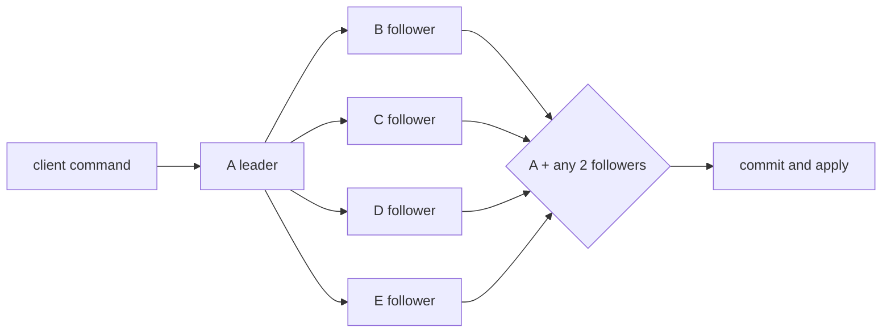

# Lesson 1 — Why etcd needs Raft

Estimated time: 10 minutes

## Goal

Understand why etcd replicates commands instead of independently changing
three databases.

```text
                 one agreed log
       +-----------------------------------+
       | put x=1 | put y=2 | delete x | ...|
       +-----------------------------------+
          /                    |             \
      member A              member B       member C
      KV state              KV state       KV state
```

If members apply commands in different orders, transactions, revisions, and
deletes can produce different results. Raft chooses a leader, creates one
ordered log, and commits an entry only after a quorum accepts it. etcd applies
committed entries to its KV state machine.

Keep these boundaries clear:

- Raft: consensus and replicated log.
- etcd: KV/auth/lease state machine.
- `rafthttp`: peer-to-peer message transport.
- WAL: durable local Raft history.

## Five-node diagram



## Recap

A local append is not automatically a successful write. It must be replicated
and committed by a quorum.
