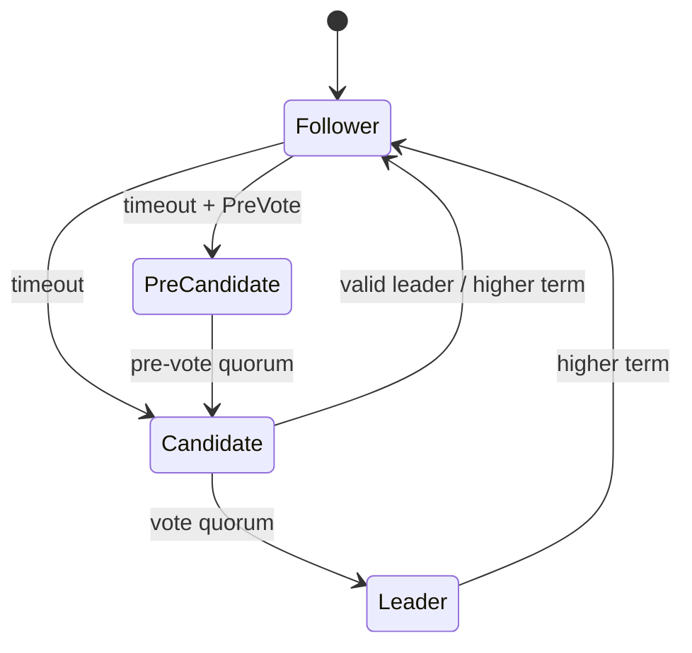
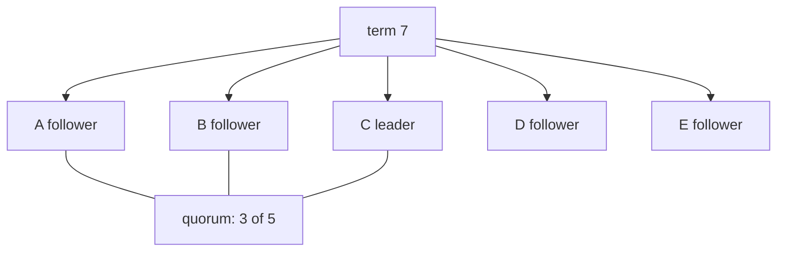

# Lesson 2 — Nodes, terms, roles, and quorum

Estimated time: 10 minutes

| Concept | Meaning |
|---|---|
| Node ID | Permanent cluster identity. |
| Term | Logical election number. |
| Vote | Member selected in the current term. |
| Commit index | Highest entry known committed. |
| Applied index | Highest entry executed by the state machine. |
| Role | Follower, candidate, pre-candidate, or leader. |



Terms reject stale messages and prevent an old leader from continuing after a
new election. For `N` voters:

```text
quorum = floor(N / 2) + 1
```

A three-member cluster needs two votes and tolerates one failure. A live node
without a majority cannot safely elect itself.

## Recap

Term and vote must survive restart, so they are part of Raft `HardState`.

## Five-node diagram


