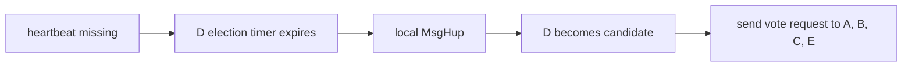

# Lesson 3 — How elections begin

Estimated time: 10 minutes

Followers and candidates use an election timer. Raft represents time as ticks;
etcd drives those ticks in [`server/etcdserver/raft.go`](../../../server/etcdserver/raft.go):

```go
func (r *raftNode) tick() {
    r.tickMu.Lock()
    r.Tick()
    r.latestTickTs = time.Now()
    r.tickMu.Unlock()
}
```

The Raft library increments `electionElapsed`. When the randomized timeout
expires, it sends `MsgHup` to itself:

```text
Tick -> electionElapsed++ -> timeout -> Step(MsgHup) -> campaign
```

Randomized timeouts reduce split votes. A valid heartbeat resets the follower's
election timer. etcd configures the timing in `bootstrap.go`:

```go
ElectionTick:  cfg.ElectionTicks,
HeartbeatTick: 1,
CheckQuorum:   true,
PreVote:       cfg.PreVote,
```

## Recap

`MsgHup` is local to the Raft state machine; it is not an HTTP request.
## Five-node diagram


