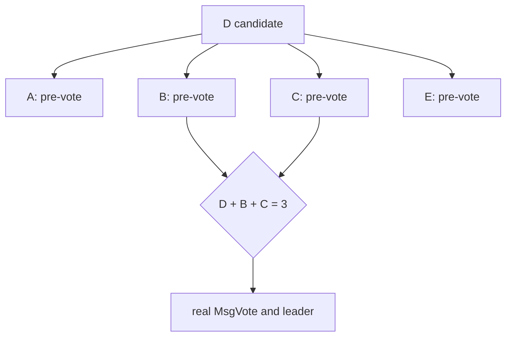

# Lesson 4 — Pre-vote and voting

Estimated time: 10 minutes

With pre-vote enabled, a real election has two phases:

```mermaid
sequenceDiagram
    participant A as candidate A
    participant B as member B
    participant C as member C
    A->>B: MsgPreVote
    A->>C: MsgPreVote
    B-->>A: MsgPreVoteResp(granted)
    C-->>A: MsgPreVoteResp(granted)
    Note over A: increment term; become candidate
    A->>B: MsgVote
    A->>C: MsgVote
    B-->>A: MsgVoteResp(granted)
    C-->>A: MsgVoteResp(granted)
    Note over A: quorum; become leader
```

Pre-vote asks whether the candidate would win without changing the durable
term. This limits disruption from an isolated member reconnecting.

For a real vote, the candidate increments its term and votes for itself. A
member votes only once per term and checks the candidate log:

```text
candidate last term > local last term
or equal terms and candidate last index >= local last index
```

The core implementation is in `go.etcd.io/raft/v3/raft.go`: `tickElection`,
`campaign`, `becomeCandidate`, `stepCandidate`, and vote handlers.

## Recap

A majority of `MsgVoteResp` makes a candidate leader; a majority of rejections
makes it a follower.
## Five-node diagram


