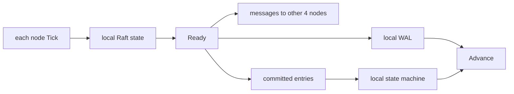

# Lesson 5 — How etcd runs Raft

Estimated time: 35–45 minutes

etcd creates a new or recovered Raft node in `bootstrap.go`:

```go
if len(b.peers) == 0 {
    n = raft.RestartNode(b.config)
} else {
    n = raft.StartNode(b.config, b.peers)
}
```

The Raft library does not write files or open sockets. It returns work through
`Ready`, and etcd performs that work:

```text
Node.Tick / Node.Ready
  -> persist HardState, entries, snapshot
  -> send messages
  -> apply committed entries
  -> Node.Advance
```

`SoftState` reports leader and role changes. `HardState` is durability work.
`CommittedEntries` are application work. The loop is in
[`server/etcdserver/raft.go`](../../../server/etcdserver/raft.go).

## Recap

Raft decides what should happen; etcd performs persistence, transport, and
state-machine application.
## Five-node diagram


+
## Detailed walkthrough of server/etcdserver/raft.go

The short model above is useful, but the ordering inside the wrapper is where
etcd’s correctness guarantees are enforced. The following sections map each
important statement in raft.go to its responsibility.

### The runtime object

~~~go
type raftNode struct {
    lg *zap.Logger
    tickMu *sync.RWMutex
    latestTickTs time.Time
    raftNodeConfig
    msgSnapC chan *raftpb.Message
    applyc chan toApply
    readStateC chan raft.ReadState
    ticker *time.Ticker
    td *contention.TimeoutDetector
    stopped chan struct{}
    done chan struct{}
}
~~~

- lg is the logger used for warnings and fatal persistence failures.
- tickMu protects calls into the Raft Node and the latest tick timestamp.
- latestTickTs lets health code determine whether this member is still ticking.
- The embedded raftNodeConfig supplies the Raft Node, WAL-backed storage,
  transport, heartbeat interval, and membership callback.
- msgSnapC is a separate path for snapshots. etcd must merge snapshot data in
  its server loop, so a snapshot is not sent as an ordinary message.
- applyc carries committed entries and snapshots to the state-machine path.
- readStateC carries ReadIndex progress to linearizable-read waiters.
- ticker produces logical Raft ticks.
- td detects delayed heartbeats.
- stopped requests shutdown; done confirms that shutdown is complete.

The toApply packet is the synchronization contract with the application layer:

~~~go
type toApply struct {
    entries []*raftpb.Entry
    snapshot *raftpb.Snapshot
    notifyc chan struct{}
    raftAdvancedC <-chan struct{}
}
~~~

entries are committed log entries, while snapshot is a compact replacement for
old state. notifyc prevents the apply path from treating a batch as stable
before its persistence work is complete. raftAdvancedC coordinates membership
application with the later Node.Advance call.

### Ticks are serialized explicitly

~~~go
func (r *raftNode) tick() {
    r.tickMu.Lock()
    r.Tick()
    r.latestTickTs = time.Now()
    r.tickMu.Unlock()
}
~~~

The Raft package does not provide locks around Node methods. The wrapper takes
the lock, advances Raft’s logical clock, records the completion time, and
releases the lock. One tick can cause an election timeout, a pre-vote, a vote,
a heartbeat, or replication progress.

### newRaftNode wires dependencies

~~~go
func (b *bootstrappedRaft) newRaftNode(
    ss *snap.Snapshotter,
    wal *wal.WAL,
    cl *membership.RaftCluster,
) *raftNode {
    var n raft.Node
    if len(b.peers) == 0 {
        n = raft.RestartNode(b.config)
    } else {
        n = raft.StartNode(b.config, b.peers)
    }
    raftStatusMu.Lock()
    raftStatus = n.Status
    raftStatusMu.Unlock()
    return newRaftNode(raftNodeConfig{
        lg: b.lg,
        isIDRemoved: func(id uint64) bool {
            return cl.IsIDRemoved(types.ID(id))
        },
        Node: n,
        heartbeat: b.heartbeat,
        raftStorage: b.storage,
        storage: serverstorage.NewStorage(b.lg, wal, ss),
    })
}
~~~

var n stores the public Node interface. RestartNode uses recovered storage;
StartNode uses the initial peers for a new cluster. The mutex makes publishing
the status callback safe. The callback returns current status instead of a
snapshot taken during bootstrap. isIDRemoved is captured as a closure so
message processing can reject destinations removed from membership. The two
storage objects have different jobs: raftStorage is the in-memory Raft log, and
storage is the durable WAL/snapshot facade.

### start has three kinds of work

~~~go
func (r *raftNode) start(rh *raftReadyHandler) {
    internalTimeout := time.Second
    go func() {
        defer r.onStop()
        islead := false
        for {
            select {
            case <-r.ticker.C:
                r.tick()
            case rd := <-r.Ready():
                // process rd
            case <-r.stopped:
                return
            }
        }
    }()
}
~~~

start returns after launching the goroutine. internalTimeout limits an internal
read-state handoff. defer guarantees cleanup. islead records the role associated
with the current Ready batch. The select handles periodic logical time,
algorithm output, and shutdown without needing a separate dispatcher.

### SoftState is observation, not durability

~~~go
if rd.SoftState != nil {
    newLeader := rd.SoftState.Lead != raft.None &&
        rh.getLead() != rd.SoftState.Lead
    if newLeader {
        leaderChanges.Inc()
    }
    if rd.SoftState.Lead == raft.None {
        hasLeader.Set(0)
    } else {
        hasLeader.Set(1)
    }
    rh.updateLead(rd.SoftState.Lead)
    islead = rd.RaftState == raft.StateLeader
    if islead {
        isLeader.Set(1)
    } else {
        isLeader.Set(0)
    }
    rh.updateLeadership(newLeader)
    r.td.Reset()
}
~~~

The nil check means no volatile role update was emitted for this batch. The
leader comparison avoids counting the same leader repeatedly. hasLeader and
isLeader expose different facts: the member may know a leader without being the
leader. updateLead changes the server’s current leader view; updateLeadership
notifies transition-sensitive code; resetting td starts heartbeat observation
again after the role update.

### ReadStates feed linearizable reads

~~~go
if len(rd.ReadStates) != 0 {
    select {
    case r.readStateC <- rd.ReadStates[len(rd.ReadStates)-1]:
    case <-time.After(internalTimeout):
        r.lg.Warn("timed out sending read state", ...)
    case <-r.stopped:
        return
    }
}
~~~

ReadStates are progress markers for ReadIndex. If several are in one Ready,
the last one is the newest. The timeout prevents a blocked reader from stopping
the Raft loop, and stopped lets shutdown interrupt the handoff.

### Applying is intentionally decoupled from persistence

~~~go
committedEntries := rd.CommittedEntries
notifyc := make(chan struct{}, 1)
raftAdvancedC := make(chan struct{}, 1)
raftSnap := proto.Clone(rd.Snapshot).(*raftpb.Snapshot)
ap := toApply{
    entries: committedEntries,
    snapshot: proto.Clone(rd.Snapshot).(*raftpb.Snapshot),
    notifyc: notifyc,
    raftAdvancedC: raftAdvancedC,
}
updateCommittedIndex(&ap, rh)
select {
case r.applyc <- ap:
case <-r.stopped:
    return
}
~~~

The application receives the batch before the rest of Ready processing finishes,
which permits useful overlap. It cannot safely proceed past its durability
wait until notifyc is signaled. Cloning the snapshot prevents the application
and persistence paths from sharing mutable protobuf state. The committed index
is the final entry index, unless the snapshot represents a later index.

### Snapshot, WAL, and memory ordering

~~~go
if !raft.IsEmptySnap(raftSnap) {
    if err := r.storage.SaveSnap(raftSnap); err != nil {
        r.lg.Fatal("failed to save Raft snapshot", zap.Error(err))
    }
}
if err := r.storage.Save(rd.HardState, rd.Entries); err != nil {
    r.lg.Fatal("failed to save Raft hard state and entries", zap.Error(err))
}
if !raft.IsEmptySnap(raftSnap) {
    if err := r.storage.Sync(); err != nil {
        r.lg.Fatal("failed to sync Raft snapshot", zap.Error(err))
    }
    notifyc <- struct{}{}
    r.raftStorage.ApplySnapshot(raftSnap)
    if err := r.storage.Release(raftSnap); err != nil {
        r.lg.Fatal("failed to release Raft wal", zap.Error(err))
    }
}
r.raftStorage.Append(rd.Entries)
~~~

SaveSnap precedes ordinary data because recovery needs the snapshot base before
it interprets later WAL entries. Save writes hard state and new entries.
Sync forces snapshot-related WAL state to stable storage. The notification
releases the apply wait. ApplySnapshot moves the in-memory base forward.
Release permits old WAL segments covered by the snapshot to be reclaimed.
Append finally reflects new entries in the in-memory storage.

### Membership changes add ordering constraints

~~~go
confChanged := false
for _, ent := range rd.CommittedEntries {
    if ent.GetType() == raftpb.EntryConfChange {
        confChanged = true
        break
    }
}
~~~

A configuration entry changes who may vote. The boolean tells the follower path
to wait for all pending configuration application before it sends messages or
allows the next election-related progress to be observed.

### Leaders and followers send at different times

~~~go
if islead {
    r.transport.Send(r.processMessages(rd.Messages))
}
~~~

The leader sends early so replication overlaps with its local disk write. This
is a deliberate throughput optimization.

~~~go
if !islead {
    msgs := r.processMessages(rd.Messages)
    notifyc <- struct{}{}
    if confChanged {
        select {
        case notifyc <- struct{}{}:
        case <-r.stopped:
            return
        }
    }
    r.transport.Send(msgs)
} else {
    notifyc <- struct{}{}
}
~~~

A follower processes messages, signals the ordinary durability barrier, waits
again when membership changed, and only then sends. That prevents a follower
from advertising progress that is not safe on its disk or using stale
membership. The leader branch only completes synchronization because the
leader’s messages were already sent; it must not send them twice.

### processMessages protects transport boundaries

~~~go
func (r *raftNode) processMessages(
    ms []*raftpb.Message,
) []*raftpb.Message {
    sentAppResp := false
    var messages []*raftpb.Message
    for i := len(ms) - 1; i >= 0; i-- {
        m := ms[i]
        if r.isIDRemoved(m.GetTo()) {
            continue
        }
        if m.GetType() == raftpb.MsgAppResp {
            if sentAppResp {
                continue
            }
            sentAppResp = true
        }
        if m.GetType() == raftpb.MsgSnap {
            select {
            case r.msgSnapC <- m:
            default:
            }
            continue
        }
        if m.GetType() == raftpb.MsgHeartbeat {
            ok, exceed := r.td.Observe(m.GetTo())
            if !ok {
                r.lg.Warn("leader failed to send out heartbeat on time", ...)
                heartbeatSendFailures.Inc()
            }
            _ = exceed
        }
        messages = append(messages, m)
    }
    return messages
}
~~~

The reverse traversal favors the newest append response. Removed destinations are
discarded. Snapshots use the bounded non-blocking msgSnapC path because etcd
must merge their state in the server loop. Heartbeats feed overload diagnostics.
All remaining messages go to rafthttp. Sending must not block; protocol retries
make dropping a network message safe.

### Advance is the acknowledgement boundary

~~~go
r.Advance()
if confChanged {
    raftAdvancedC <- struct{}{}
}
~~~

Advance tells the Raft library that etcd consumed this Ready batch. It must come
after the persistence, message, and application coordination required by the
batch. For a membership change, raftAdvancedC lets the server know that the
Raft layer has advanced too.

### Shutdown is synchronous for callers

~~~go
func (r *raftNode) stop() {
    select {
    case r.stopped <- struct{}{}:
    case <-r.done:
        return
    }
    <-r.done
}

func (r *raftNode) onStop() {
    r.Stop()
    r.ticker.Stop()
    r.transport.Stop()
    if err := r.storage.Close(); err != nil {
        r.lg.Panic("failed to close Raft storage", zap.Error(err))
    }
    close(r.done)
}
~~~

stop sends one request unless the loop already completed, then waits for done.
onStop stops the Raft node, ticker, and transport, closes durable storage, and
closes done last. Therefore a caller that returns from stop knows cleanup has
finished.

## Ready field reference

| Field | Meaning | etcd action |
| --- | --- | --- |
| SoftState | Volatile leader and role view | Update server state and metrics |
| HardState | Term, vote, and commit durability state | Save to WAL |
| Entries | Newly generated log entries | Save, then append to memory |
| Snapshot | Compact replacement state | Save, sync, apply, release old WAL |
| CommittedEntries | Entries safe by quorum | Send to the state machine |
| Messages | Protocol output | Filter, route, and transport |
| ReadStates | ReadIndex progress | Forward the newest state |

The most important distinction is Entries versus CommittedEntries: an entry can
be present in the replicated log without being committed. etcd applies only
committed entries.

## End-to-end write

~~~text
client request
  -> etcd encodes an operation as a Raft proposal
  -> leader appends an entry
  -> Ready.Entries contains the entry
  -> etcd saves it to the WAL
  -> leader sends append messages
  -> followers persist and acknowledge
  -> quorum commits the entry
  -> a later Ready contains CommittedEntries
  -> etcd sends toApply to the server loop
  -> the key-value state machine applies the operation
  -> notifyc releases the durability wait
  -> raftNode calls Advance
~~~

Raft never directly mutates the key-value database. It establishes order and
commitment for opaque entries; etcd gives those entries application meaning.
