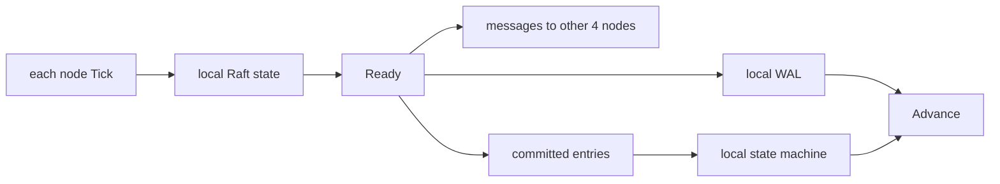

# Lesson 5 — How etcd runs Raft

Estimated time: 10 minutes

etcd creates a new or recovered Raft node in `bootstrap.go`:

```go
if len(b.peers) == 0 {
    n = raft.RestartNode(b.config)
} else {
    n = raft.StartNode(b.config, b.peers)
}
```

The Raft library does not write files or open sockets. It returns work through
`Ready`, and etcd performs that work:

```text
Node.Tick / Node.Ready
  -> persist HardState, entries, snapshot
  -> send messages
  -> apply committed entries
  -> Node.Advance
```

`SoftState` reports leader and role changes. `HardState` is durability work.
`CommittedEntries` are application work. The loop is in
[`server/etcdserver/raft.go`](../../../server/etcdserver/raft.go).

## Recap

Raft decides what should happen; etcd performs persistence, transport, and
state-machine application.
## Five-node diagram


