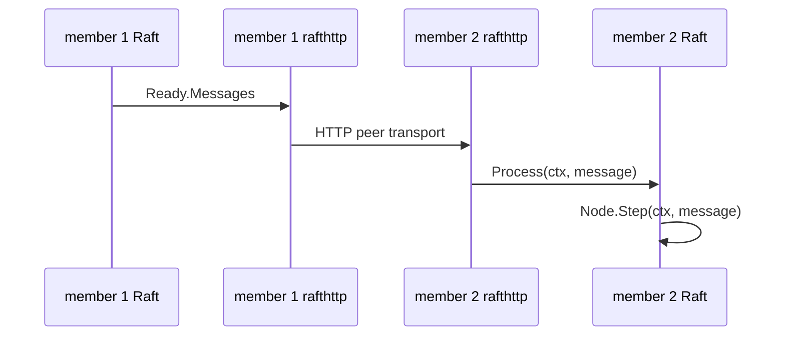
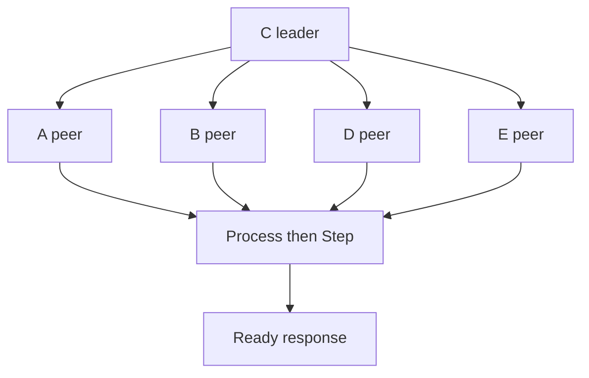

# Lesson 6 — Messages and rafthttp

Estimated time: 10 minutes

Important messages include:

| Message | Purpose |
|---|---|
| `MsgVote` / response | Election. |
| `MsgPreVote` / response | Pre-election. |
| `MsgApp` / response | Log replication. |
| `MsgHeartbeat` / response | Liveness and commit notification. |
| `MsgSnap` | Snapshot installation. |

`EtcdServer.Process` validates sender, receiver, and removed-member status,
then calls `s.r.Step(ctx, m)`. Read
[`server.go`](../../../server/etcdserver/server.go) and
[`rafthttp/peer.go`](../../../server/etcdserver/api/rafthttp/peer.go).

The HTTP layer carries protobuf messages; it does not decide elections.

## Recap

Debug message flow in order: transport delivery, `Process` validation, then
Raft's message handler.
## Five-node diagram

## Detailed walkthrough

This lesson follows a message from one Raft state machine to another. Raft
creates protocol messages; rafthttp moves them; the receiving server validates
them and calls Node.Step. No HTTP handler decides whether a vote wins.

### The message boundary

~~~go
func (s *EtcdServer) Process(ctx context.Context, m raftpb.Message) error {
    if s.cluster.IsIDRemoved(types.ID(m.From)) {
        return ErrMemberNotFound
    }
    return s.r.Step(ctx, m)
}
~~~

The real implementation performs additional cluster and version checks, but the
responsibilities are represented here:

- From identifies the sender and must belong to the current cluster.
- To identifies the receiving member; messages for removed members are rejected.
- protobuf decoding turns the wire payload into raftpb.Message.
- Step passes the message into the Raft state machine.
- The receiver’s role, term, vote, and log determine the result.
- A response is not sent directly by Process; Raft emits it later through
  Ready.Messages.

### Message families

| Family | Request | Response | What changes |
| --- | --- | --- | --- |
| Election | MsgVote | MsgVoteResp | Candidate vote counts |
| Pre-election | MsgPreVote | MsgPreVoteResp | Whether an election is viable |
| Replication | MsgApp | MsgAppResp | Follower log and leader progress |
| Liveness | MsgHeartbeat | MsgHeartbeatResp | Timers and commit visibility |
| Recovery | MsgSnap | snapshot handling | Follower state and log base |

A message carries a term and log metadata. A receiver with a newer term can
force a sender to step down. A stale message can be ignored or answered without
changing the current leader.

### rafthttp does not own consensus

The peer layer selects a peer by member ID, serializes protobuf, chooses a
pipeline or stream connection, retries connection failures, applies
backpressure, and delivers the message to the remote Process endpoint. Raft
still owns term comparison, elections, log matching, commit advancement, and
response generation.

### Ordinary messages versus snapshots

~~~go
if m.GetType() == raftpb.MsgSnap {
    select {
    case r.msgSnapC <- m:
    default:
        // drop when the bounded queue is full
    }
    continue
}
messages = append(messages, m)
~~~

Ordinary protocol messages go to rafthttp. A snapshot is routed to the etcd
server loop because etcd combines store and v3 key-value state. The queue is
bounded and non-blocking, so a slow snapshot consumer cannot freeze Raft.

### Complete round trip

~~~text
local Raft Node
  -> Ready.Messages
  -> raftNode.processMessages
  -> rafthttp.Transporter.Send
  -> peer HTTP/stream endpoint
  -> remote EtcdServer.Process
  -> remote raftNode.Step
  -> remote Raft state machine
  -> remote Ready.Messages
~~~

When debugging, inspect message ID, From, To, term, type, and log indexes. A
message being created proves only that local Raft made a decision; it does not
prove network delivery or remote acceptance.

A failed HTTP request does not make an append committed. The leader advances
follower progress only after a valid MsgAppResp. The next Ready may contain a
retry, backoff, or snapshot request.

## Debugging checklist

1. Was the message emitted by Ready?
2. Was its destination still a cluster member?
3. Did rafthttp select a usable peer connection?
4. Did the receiver accept the cluster and term?
5. Did Node.Step produce a response?
6. Did that response return through Ready and transport?
7. Did the leader’s progress tracker advance?

The invariant is: transport delivers messages, but only Raft interprets them.
