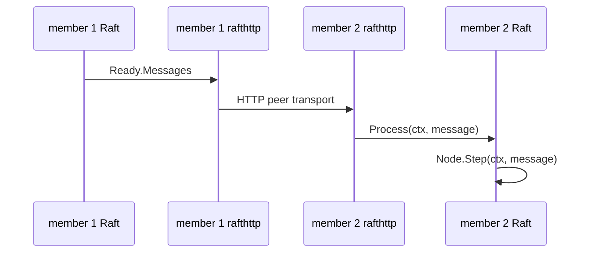
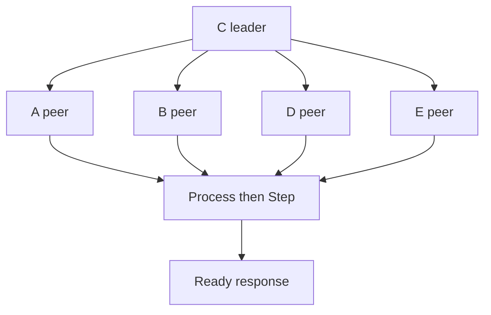

# Lesson 6 — Messages and rafthttp

Estimated time: 10 minutes

Important messages include:

| Message | Purpose |
|---|---|
| `MsgVote` / response | Election. |
| `MsgPreVote` / response | Pre-election. |
| `MsgApp` / response | Log replication. |
| `MsgHeartbeat` / response | Liveness and commit notification. |
| `MsgSnap` | Snapshot installation. |

`EtcdServer.Process` validates sender, receiver, and removed-member status,
then calls `s.r.Step(ctx, m)`. Read
[`server.go`](../../../server/etcdserver/server.go) and
[`rafthttp/peer.go`](../../../server/etcdserver/api/rafthttp/peer.go).

The HTTP layer carries protobuf messages; it does not decide elections.

## Recap

Debug message flow in order: transport delivery, `Process` validation, then
Raft's message handler.
## Five-node diagram

