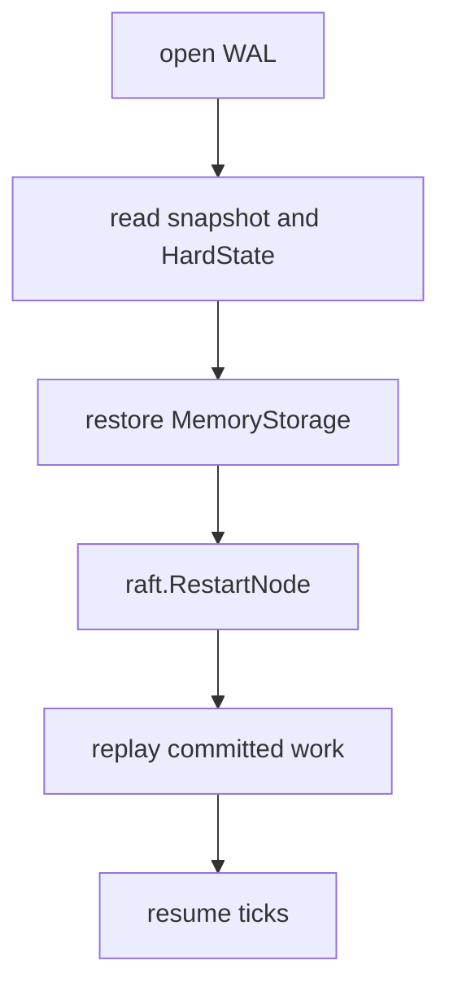
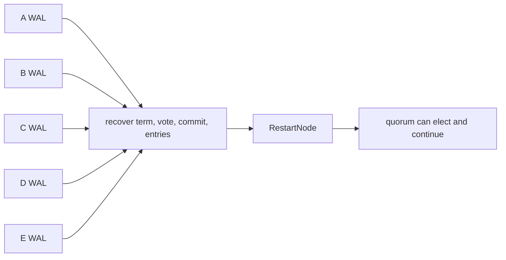

# Lesson 7 — WAL and recovery

Estimated time: 10 minutes

Raft's safety-critical durable state is:

```text
HardState { term, vote, commit }
log entries
snapshots and metadata
```

etcd persists it in the Ready loop:

```go
if err := r.storage.Save(rd.HardState, rd.Entries); err != nil {
    r.lg.Fatal("failed to save Raft hard state and entries", zap.Error(err))
}
```

This is in [`raft.go`](../../../server/etcdserver/raft.go), through the
storage adapter and WAL.

There is no separate “election started” text record. The election is inferred
from term, vote, log, and later messages. Timer values and current role are
runtime state.



## Recap

`persisted`, `committed`, and `applied` describe different stages.
## Five-node diagram


