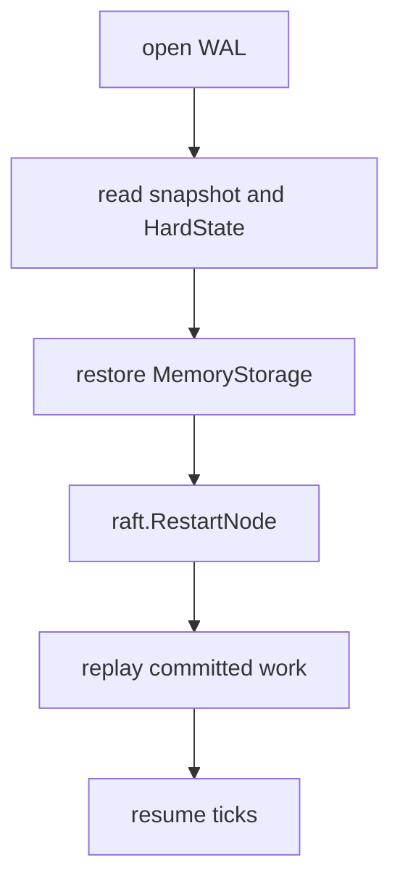
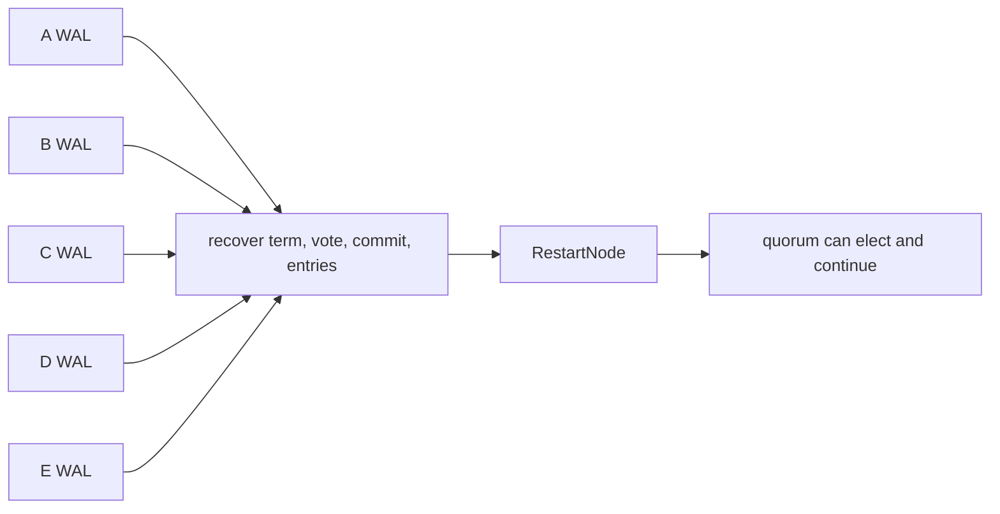

# Lesson 7 — WAL and recovery

Estimated time: 10 minutes

Raft's safety-critical durable state is:

```text
HardState { term, vote, commit }
log entries
snapshots and metadata
```

etcd persists it in the Ready loop:

```go
if err := r.storage.Save(rd.HardState, rd.Entries); err != nil {
    r.lg.Fatal("failed to save Raft hard state and entries", zap.Error(err))
}
```

This is in [`raft.go`](../../../server/etcdserver/raft.go), through the
storage adapter and WAL.

There is no separate “election started” text record. The election is inferred
from term, vote, log, and later messages. Timer values and current role are
runtime state.



## Recap

`persisted`, `committed`, and `applied` describe different stages.
## Five-node diagram



## Detailed walkthrough

A WAL is not the database. It is the durable record that lets Raft reconstruct
term, vote, commit index, and log after a crash. The backend stores materialized
application state; snapshots and consistent-index metadata connect the timelines.

### What must survive

~~~text
HardState { term, vote, commit }
log entries
snapshot metadata and snapshot data
~~~

- term prevents a restarted node from acting in an old election;
- vote prevents voting twice in one term;
- commit prevents forgetting the highest committed index;
- entries preserve both committed history and uncommitted history that a future
  leader may need to reconcile;
- snapshot metadata identifies the compacted log boundary.

### The Ready persistence boundary

~~~go
if !raft.IsEmptySnap(raftSnap) {
    if err := r.storage.SaveSnap(raftSnap); err != nil {
        r.lg.Fatal("failed to save Raft snapshot", zap.Error(err))
    }
}
if err := r.storage.Save(rd.HardState, rd.Entries); err != nil {
    r.lg.Fatal("failed to save Raft hard state and entries", zap.Error(err))
}
~~~

The snapshot is saved first because it establishes the base index for replay.
Save records hard state and newly produced entries in the WAL-backed adapter. A
persistence error is fatal: continuing would let memory move beyond recovery.

### Syncing and releasing

~~~go
if !raft.IsEmptySnap(raftSnap) {
    if err := r.storage.Sync(); err != nil {
        r.lg.Fatal("failed to sync Raft snapshot", zap.Error(err))
    }
    notifyc <- struct{}{}
    r.raftStorage.ApplySnapshot(raftSnap)
    if err := r.storage.Release(raftSnap); err != nil {
        r.lg.Fatal("failed to release Raft wal", zap.Error(err))
    }
}
~~~

Sync makes snapshot-related WAL state stable. notifyc releases the apply path
only after that point. ApplySnapshot moves the in-memory log base forward.
Release can then reclaim obsolete segments. Releasing first would leave recovery
without the snapshot that replaces those segments.

### Reopening after a crash

~~~text
open backend and snapshotter
  -> open WAL
  -> read the last valid snapshot
  -> read hard state and entries after that snapshot
  -> restore raft.MemoryStorage
  -> call raft.RestartNode
  -> replay committed work through the apply path
  -> resume ticking
~~~

Restart reconstructs protocol state; it does not mean every committed entry has
already been applied locally. Recovery compares applied and committed progress
and replays the missing range.

### Indexes that must not be confused

| Index | Owner | Meaning |
| --- | --- | --- |
| Raft log index | Raft | Position in replicated command history |
| Commit index | Raft | Highest index safe by quorum |
| Applied index | etcd state machine | Highest index executed locally |
| MVCC revision | backend | Logical database revision |

### Crash cases

- Before WAL save: Raft can emit the work again after restart.
- After WAL save but before quorum: the entry is durable locally but may be
  overwritten by a future leader.
- After commit but before apply: recovery replays the committed entry.
- During snapshot installation: snapshot/WAL ordering decides the safe boundary.
- After apply but before response: the state is durable even if the client must
  retry its request.

There is no separate election-started record. Election history is inferred from
durable term, vote, log state, and messages received after restart.
