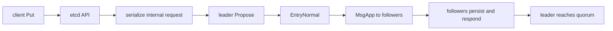
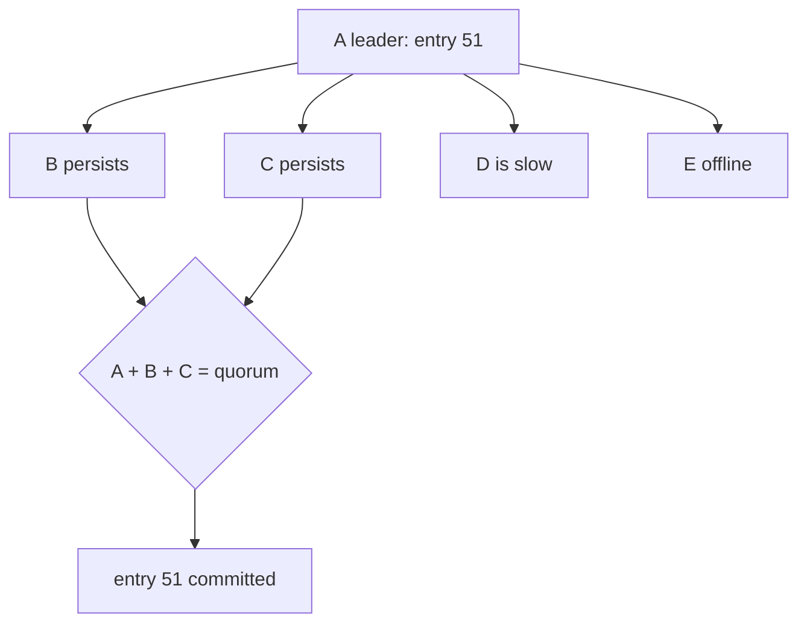

# Lesson 8 — Proposals and replication

Estimated time: 10 minutes



The client request becomes an etcd internal request inside an `EntryNormal`.
The leader appends it, sends `MsgApp`, and tracks each follower's progress.
If an append does not match, the leader retries from an earlier index. If the
needed history was compacted, it sends a snapshot instead.

For three members, two durable copies provide a quorum:

```text
leader:   1  2  3
member 2: 1  2  3
member 3: 1  2
                 ^ entry 3 can commit
```

## Recap

The replicated object is the ordered command entry, not a direct copy of the
final database pages.
## Five-node diagram



## Detailed walkthrough

A proposal is an application command packaged as a Raft log entry. The leader
does not copy database pages. It replicates an ordered command, and each member
applies that command to its own state machine.

### From API request to proposal

~~~text
client Put
  -> gRPC/API validation
  -> internal request encoding
  -> raft.Node.Propose
  -> leader appends EntryNormal
  -> Ready.Entries and Ready.Messages
~~~

The payload is opaque to Raft. The apply path later decodes the request and
dispatches it to the KV, lease, auth, or maintenance state machine. A follower
normally redirects or forwards a client proposal because only the leader
establishes cluster-wide order.

### Entry fields

~~~go
type Entry struct {
    Term  uint64
    Index uint64
    Type  raftpb.EntryType
    Data  []byte
}
~~~

Term identifies the leader term, Index identifies the history position, Type
distinguishes normal commands from membership changes, and Data contains the
serialized etcd request.

### MsgApp replication

~~~text
leader progress for follower B
  -> choose prevLogIndex and prevLogTerm
  -> include entries after that point
  -> include leader commit index
  -> send MsgApp
  -> follower checks the previous entry
  -> follower appends or rejects
  -> follower returns MsgAppResp
  -> leader updates B's match/next progress
~~~

The previous-index/previous-term check is the log-matching invariant. On
rejection, the leader backs up and retries from an earlier index.

### Why a quorum commits

~~~text
leader:    1  2  3
follower2: 1  2  3
follower3: 1  2
                    ^ index 3 is on a quorum
~~~

For three voters, the leader plus one follower form a majority. An offline
member does not prevent progress while a quorum remains available. Learners
receive data but do not count as voters.

### Progress and snapshots

A follower’s progress records its highest matched index. A successful
MsgAppResp moves that point forward; a rejection moves the next attempt
backward. If the required history is older than the leader’s compacted log,
ordinary MsgApp cannot repair the follower, so the leader sends MsgSnap.

### Backpressure

Ready batches, maximum message size, and maximum in-flight messages bound
replication work. Batching reduces overhead, but entries remain ordered. Slow
transport or disk is reflected by follower responses; a send attempt alone
never proves replication.

### Invariant

A leader announces commitment only after the entry is durably present on a
quorum and current-term/membership rules permit the commit. Replication success
is not application success: a follower may have the entry before applying it.
