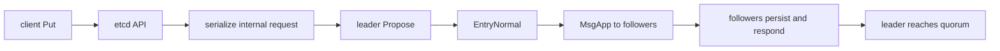
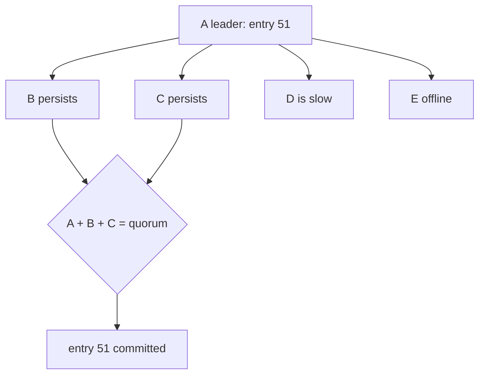

# Lesson 8 — Proposals and replication

Estimated time: 10 minutes



The client request becomes an etcd internal request inside an `EntryNormal`.
The leader appends it, sends `MsgApp`, and tracks each follower's progress.
If an append does not match, the leader retries from an earlier index. If the
needed history was compacted, it sends a snapshot instead.

For three members, two durable copies provide a quorum:

```text
leader:   1  2  3
member 2: 1  2  3
member 3: 1  2
                 ^ entry 3 can commit
```

## Recap

The replicated object is the ordered command entry, not a direct copy of the
final database pages.
## Five-node diagram


