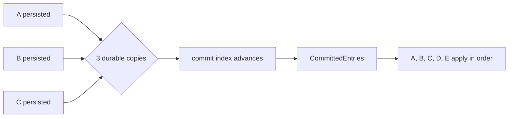

# Lesson 9 — Commit and apply

Estimated time: 10 minutes

```text
persisted -> replicated to quorum -> committed -> applied -> response
```

- Persisted: present on local durable storage.
- Committed: safe according to Raft and known to be on a quorum.
- Applied: executed by etcd's KV/auth/lease state machine.

Raft exposes committed entries through `Ready.CommittedEntries`. etcd sends
them through its apply path:

```text
Ready.CommittedEntries -> toApply -> apply scheduler -> KV state machine
```

Entries are applied in order. If the process crashes after persistence but
before application, recovery replays the committed history. Configuration
entries additionally trigger `ApplyConfChange`.

## Recap

Commit is a Raft decision; apply is the application executing that decision.
## Five-node diagram


