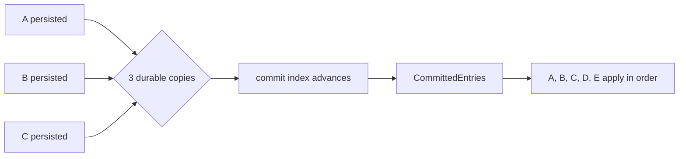

# Lesson 9 — Commit and apply

Estimated time: 10 minutes

```text
persisted -> replicated to quorum -> committed -> applied -> response
```

- Persisted: present on local durable storage.
- Committed: safe according to Raft and known to be on a quorum.
- Applied: executed by etcd's KV/auth/lease state machine.

Raft exposes committed entries through `Ready.CommittedEntries`. etcd sends
them through its apply path:

```text
Ready.CommittedEntries -> toApply -> apply scheduler -> KV state machine
```

Entries are applied in order. If the process crashes after persistence but
before application, recovery replays the committed history. Configuration
entries additionally trigger `ApplyConfChange`.

## Recap

Commit is a Raft decision; apply is the application executing that decision.
## Five-node diagram



## Detailed walkthrough

Persisted, committed, applied, and responded describe different events.
Conflating them creates incorrect conclusions during debugging.

### Four milestones

~~~text
persisted -> replicated to quorum -> committed -> applied -> response
~~~

- Persisted means a local WAL can recover the entry.
- Replicated means the entry is present on enough members.
- Committed means Raft has advanced its commit index.
- Applied means the local etcd state machine executed it.
- Response means the client handler returned a result.

An entry can be persisted without being committed, committed without being
applied locally, or applied before a response reaches the client.

### Ready to apply

~~~go
committedEntries := rd.CommittedEntries
ap := toApply{
    entries: committedEntries,
    snapshot: proto.Clone(rd.Snapshot).(*raftpb.Snapshot),
    notifyc: notifyc,
    raftAdvancedC: raftAdvancedC,
}
select {
case r.applyc <- ap:
case <-r.stopped:
    return
}
~~~

CommittedEntries is the Raft output the application executes. The unbuffered
channel provides backpressure. notifyc lets the apply scheduler wait for
persistence, while raftAdvancedC handles configuration-entry ordering.

### Ordered application

The server receives toApply packets and schedules them FIFO. Applying index 12
before index 11 could create a state that never existed in committed history.
Workers may be asynchronous internally, but observable Raft indexes advance in
order.

The state-machine layer decodes each entry and dispatches it to KV, lease, auth,
or membership logic. Raft supplies ordering; the state machine supplies meaning.

### Configuration entries

A membership entry is committed like any other entry, but applying it updates
the active cluster and transport peers. ApplyConfChange must be coordinated with
Raft advancement so the next election does not count removed or not-yet-active
members incorrectly.

### Snapshot application

A snapshot is a compact state-machine image plus a Raft index boundary. Applying
it replaces older application history; later committed entries replay after the
snapshot index. The backend and Raft memory must agree on that boundary.

### Responses and failures

A client response normally waits until the operation is applied locally, not
merely appended. If apply fails, the server reports failure while preserving the
recovery invariant. A crash before response can be resolved by replaying the
committed operation during recovery.

### Debugging table

| Observation | Proves | Does not prove |
| --- | --- | --- |
| WAL contains entry | Local persistence | Quorum or application |
| Commit index advanced | Raft commitment | Local execution |
| CommittedEntries emitted | Raft handed work to etcd | Apply completed |
| Applied index advanced | Local execution | Client got response |
| Response returned | Request completed | Every follower applied |

Application follows committed order. It never creates commitment itself.
