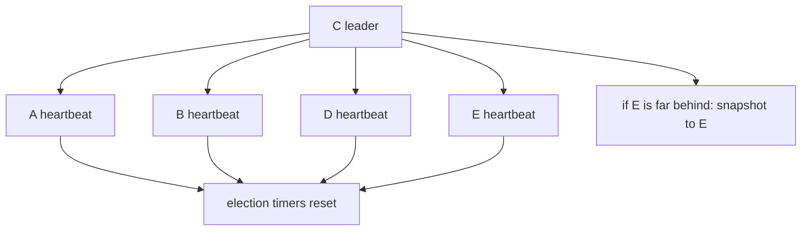

# Lesson 10 — Heartbeats, snapshots, and membership

Estimated time: 10 minutes

### Heartbeats

The leader's heartbeat ticks produce `MsgHeartbeat`:

```text
leader -- MsgHeartbeat --> followers
leader <-- MsgHeartbeatResp -- followers
```

Heartbeats reset follower timers, communicate commit progress, and let the
leader measure activity. `CheckQuorum: true` prevents a partitioned leader
from acting as a healthy majority leader.

### Snapshots

Compaction replaces old log entries with a state snapshot:

```text
snapshot at index 90000 + entries 90001 ... current
```

When a follower needs compacted history, the leader sends `MsgSnap`; after the
follower installs it, normal `MsgApp` replication resumes.

### Membership

Adding or removing a member is itself a replicated entry:

```text
ProposeConfChange -> replicate -> commit -> ApplyConfChange
```

It changes voters, quorum calculations, transport peers, and future elections.

## Recap

A follower missing compacted entries is repaired with a snapshot, not ordinary
append replication.
## Five-node diagram


