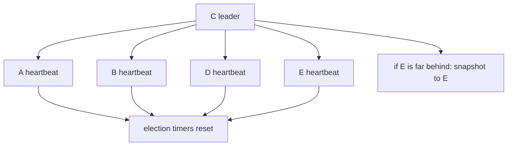

# Lesson 10 — Heartbeats, snapshots, and membership

Estimated time: 10 minutes

### Heartbeats

The leader's heartbeat ticks produce `MsgHeartbeat`:

```text
leader -- MsgHeartbeat --> followers
leader <-- MsgHeartbeatResp -- followers
```

Heartbeats reset follower timers, communicate commit progress, and let the
leader measure activity. `CheckQuorum: true` prevents a partitioned leader
from acting as a healthy majority leader.

### Snapshots

Compaction replaces old log entries with a state snapshot:

```text
snapshot at index 90000 + entries 90001 ... current
```

When a follower needs compacted history, the leader sends `MsgSnap`; after the
follower installs it, normal `MsgApp` replication resumes.

### Membership

Adding or removing a member is itself a replicated entry:

```text
ProposeConfChange -> replicate -> commit -> ApplyConfChange
```

It changes voters, quorum calculations, transport peers, and future elections.

## Recap

A follower missing compacted entries is repaired with a snapshot, not ordinary
append replication.
## Five-node diagram



## Detailed walkthrough

Heartbeats keep a healthy leader visible, snapshots bound the amount of log
history, and membership changes alter the set of processes that may vote.

### Heartbeat messages

~~~text
leader tick
  -> MsgHeartbeat(commit index)
  -> follower resets election timer
  -> follower returns MsgHeartbeatResp
  -> leader observes liveness and progress
~~~

A heartbeat is an empty replication probe with commit information. It tells a
follower that the leader is still valid for the term and communicates a newer
commit index. A follower must not start an election while valid leader traffic
arrives.

CheckQuorum makes the leader monitor majority responses. A partitioned leader
may still talk to clients, but it must step down when it cannot confirm a
majority, preventing a minority partition from acting as healthy leader.

### Snapshots and compaction

~~~text
state machine at index 90000
  + snapshot metadata at 90000
  + retained entries 90001 ... current
  - obsolete entries before 90000
~~~

Compaction removes history no longer needed for replay. The snapshot must
represent state at its metadata index. It does not replace the backend: the
backend is the materialized database, while the Raft snapshot is the recovery
image and log boundary.

### A follower too far behind

~~~text
leader sends MsgApp at index 50000
  -> follower needs index 10000
  -> leader compacted before index 40000
  -> MsgApp cannot satisfy the request
  -> leader sends MsgSnap
  -> follower installs snapshot
  -> follower resumes MsgApp at snapshot index + 1
~~~

After installation, in-memory Raft storage and application state must advance
together. The next ordinary append fills the remaining suffix.

### Membership is replicated data

~~~text
propose configuration change
  -> EntryConfChange
  -> replicate and commit
  -> apply membership change
  -> update peers and transport
  -> future quorum/elections use new membership
~~~

Adding, removing, or promoting a member is not a local map edit. It is a
committed command so every member observes the same membership history.
Removed-member checks prevent stale messages from reaching a departed node.

Learners replicate log data but are not voters. They allow catch-up before
promotion, avoiding an immediate quorum change for a member without history.

### Ordering invariants

- Save the snapshot before later WAL entries.
- Sync before signaling durability to the apply path.
- Apply membership changes before counting the new voter set.
- Never send messages to removed IDs.
- Do not treat one heartbeat as proof that a majority is healthy; CheckQuorum
  requires evidence from enough members.

### Maintenance timeline

~~~text
ticks create heartbeats
  -> replication advances follower progress
  -> committed entries are applied
  -> snapshotter compacts old history
  -> lagging follower receives snapshot
  -> membership entry changes future quorum
~~~

For liveness debugging, check tick timestamp, leader term, heartbeat responses,
CheckQuorum status, follower progress, snapshot index, and membership state.
