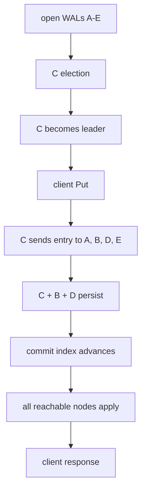

# Lesson 11 — Putting everything together

Estimated time: 10 minutes

This lesson traces startup, election, a `Put`, persistence, commit, apply, and
the client response.

## Startup

```text
open WAL/snapshot -> restore HardState and entries
-> raft.RestartNode or StartNode -> start Tick/Ready loop
```

## Election

```text
no heartbeat -> election timeout -> MsgHup
-> PreVote (if enabled) -> MsgVote -> quorum
-> candidate becomes leader -> heartbeats begin
```

## Put request

```mermaid
sequenceDiagram
    participant C as client
    participant E as etcd API
    participant L as leader
    participant F as followers
    participant W as WAL
    participant K as KV state machine
    C->>E: Put(key, value)
    E->>L: Propose(internal request)
    L->>W: persist HardState / EntryNormal
    L->>F: MsgApp(entry)
    F->>F: persist entry
    F-->>L: MsgAppResp
    L->>L: quorum; advance commit
    L->>W: persist commit progress
    L->>K: apply CommittedEntry
    K-->>E: operation result
    E-->>C: Put response
```

The complete ordering is:

```text
proposal -> append -> durable quorum -> commit index
          -> CommittedEntries -> KV apply -> response
```

If the leader fails after commitment, another member with the committed
history can lead. If the process crashes, the WAL restores the hard state and
log, and the apply path catches up.

## Source map

| File | Responsibility |
|---|---|
| `bootstrap.go` | Creates storage and the Raft node. |
| `raft.go` | Drives ticks, Ready, persistence, transport, and Advance. |
| `server.go` | Validates incoming messages and calls Step. |
| `rafthttp/peer.go` | Receives peer messages. |
| storage/WAL | Persists state, entries, and snapshots. |
| Raft module | Implements elections and replication. |
| etcd apply path | Executes committed requests. |

## Final mental model

```text
Raft chooses one history.
The WAL remembers it.
rafthttp distributes protocol messages.
Quorum makes entries committed.
etcd applies committed entries to the state machine.
```

When debugging, inspect term/vote/role/leader first, then election messages,
WAL persistence, replication acknowledgements, commit index, and finally the
apply path.
## Five-node end-to-end diagram


