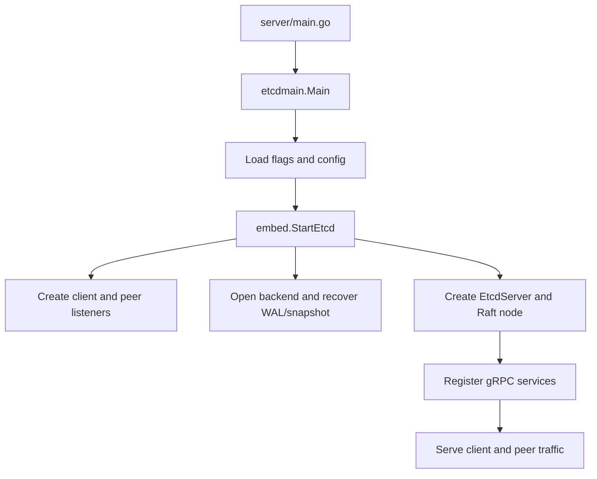

# Guide 1: orientation and architecture

This guide builds a runnable mental model of the repository before you study distributed-systems details.

## Outcome

By the end, you should be able to name the main binaries, explain the Go-module boundaries, start one member, and point to the code that creates listeners, services, Raft, and storage.

## Concept links

- [Raft consensus](https://raft.github.io/) — replicated log and leader election used by etcd.
- [gRPC introduction](https://grpc.io/docs/what-is-grpc/introduction/) — RPC transport used by `client/v3` and server services.
- [Go workspaces](https://go.dev/doc/tutorial/workspaces) — why several modules build as one checkout.
- [etcd architecture](https://etcd.io/docs/latest/learning/why/) — project rationale and terminology.

## Prerequisites

- Go 1.26, as declared in `go.work`.
- A shell with `git`, `go`, and (for the full test workflow) Bash-compatible scripts.
- The repository root as the current directory.

## Step 1: learn the vocabulary

Read [README.md](../README.md) and [modules.md](../Documentation/contributor-guide/modules.md). Write a short definition for: member, cluster, client endpoint, peer endpoint, revision, Raft term, WAL, snapshot, watch, lease, and transaction.

The most important distinction is that a client endpoint serves the public API (normally port 2379), while a peer endpoint carries Raft and snapshot traffic (normally port 2380).

## Step 2: map the workspace

Read [go.work](../go.work). It lists the modules developed together:

```text
api, cache, client/pkg, client/v3, etcdctl, etcdutl,
pkg, server, tests, and tool modules
```

Then read the root [go.mod](../go.mod). Local `replace` directives make imports such as `go.etcd.io/etcd/server/v3` resolve to this checkout during development. This is why the repository is one tree but not one package.

## Step 3: identify executable entry points

Follow these files in order:

1. [server/main.go](../server/main.go) — deliberately tiny wrapper.
2. [server/etcdmain/main.go](../server/etcdmain/main.go) — chooses normal server or proxy mode.
3. `server/etcdmain/etcd.go` and neighboring files — flags, config loading, and startup orchestration.
4. [server/embed/etcd.go](../server/embed/etcd.go) — `StartEtcd` validates configuration, creates listeners, initializes the server, and starts serving.
5. [etcdctl/main.go](../etcdctl/main.go) → [etcdctl/ctlv3/ctl.go](../etcdctl/ctlv3/ctl.go) — CLI root and command registration.
6. [etcdutl/ctl.go](../etcdutl/ctl.go) — offline administration commands.

At this stage, do not dive into every helper. Record each function that hands control to the next layer.

## Step 4: build and run one member

```bash
make build
./bin/etcd --data-dir ./tmp/etcd-orientation
```

In another terminal:

```bash
./bin/etcdctl endpoint health
./bin/etcdctl endpoint status -w table
```

Observe the startup log. Match each log group to configuration, listener setup, backend opening, Raft readiness, and gRPC serving.

## Step 5: locate the server containers

Use this ownership map while reading:

| Runtime responsibility | Source area |
|---|---|
| Configuration and validation | `server/config/` |
| Embedded lifecycle and listeners | `server/embed/` |
| Core member state machine | `server/etcdserver/` |
| gRPC service registration | `server/etcdserver/api/v3rpc/grpc.go` |
| Peer messaging | `server/etcdserver/api/rafthttp/` |
| Consensus wrapper | `server/etcdserver/raft.go` |
| WAL, snapshots, backend recovery | `server/storage/`, `server/etcdserver/bootstrap.go` |
| Public wire contracts | `api/etcdserverpb/`, `api/mvccpb/` |

### Startup flow



The three branches after `StartEtcd` represent responsibilities initialized during startup. Readiness is reached only after the member has recovered enough state, initialized Raft, and can serve registered APIs; merely opening a listener is not sufficient.

## Step 6: draw your first architecture sketch

Draw boxes for `etcdctl`, `clientv3`, `api/v3`, `server/v3`, `raft/v3`, and `storage`. Add arrows for “gRPC”, “propose/commit”, “persist”, and “apply”. Compare it with the architecture diagrams in [repo-guide.md](repo-guide.md).

## Investigation questions

- Which package can an external application import safely?
- Which code is generated from protobuf definitions?
- Where does the server become ready, and how does an embedded caller detect readiness?
- Which components are shared by `etcdctl` and a custom Go client?

## Checkpoint

Continue only when you can explain startup from `main()` to a listening gRPC server and can locate the code for configuration, API registration, Raft, and storage without searching the entire tree.

## Common mistakes

- Treating the root module as the whole product; it is mainly a workspace coordinator.
- Reading generated `.pb.go` files as if they were hand-written business logic.
- Assuming `etcdctl` talks directly to bbolt; it talks to the network API.
- Starting with Raft internals before understanding the etcd wrapper and request lifecycle.
