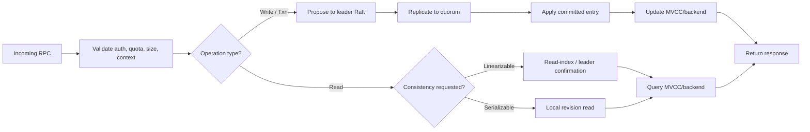

# Guide 2: trace the request path

This guide follows one write, one read, one transaction, and one watch from client code to server state.

## Outcome

You should be able to explain where validation happens, how a request becomes a Raft proposal, when it becomes visible, and why reads have different consistency paths.

## Concept links

- [etcd API concepts](https://etcd.io/docs/latest/learning/api/) — revisions, ranges, transactions, watches, and leases.
- [gRPC core concepts](https://grpc.io/docs/what-is-grpc/core-concepts/) — generated clients, deadlines, metadata, and streaming.
- [Linearizability](https://jepsen.io/consistency/models/linearizability) — the consistency guarantee behind linearizable reads.
- [MVCC](https://en.wikipedia.org/wiki/Multiversion_concurrency_control) — versioned state used for historical revisions.

## Step 1: start at the client API

Read [client/v3/kv.go](../client/v3/kv.go), then [client/v3/op.go](../client/v3/op.go) and [client/v3/txn.go](../client/v3/txn.go). Identify:

- the public `KV` and `Txn` interfaces;
- conversion from convenience methods to protobuf requests;
- call options for ranges, revisions, sorting, limits, and transactions;
- the `remote` gRPC client and retry wrapper.

## Step 2: inspect the wire contract

Open the generated interfaces under `api/etcdserverpb/`. Locate `KVClient`, `KVServer`, `RangeRequest`, `PutRequest`, `TxnRequest`, and their responses. Treat these as the stable protocol boundary; implementation details belong on either side.

## Step 3: locate server registration and handlers

Read [server/etcdserver/api/v3rpc/grpc.go](../server/etcdserver/api/v3rpc/grpc.go). List the registered services: KV, Watch, Lease, Cluster, Auth, Health, and Maintenance. Then open the concrete KV handler file in the same directory and identify its calls into `EtcdServer`.

## Step 4: trace a write

Run:

```bash
./bin/etcdctl put learning "first value" -w json
```

Follow this conceptual chain:

```text
clientv3.Put
  -> OpPut / PutRequest
  -> gRPC KV.Put
  -> EtcdServer proposal submission
  -> leader Raft proposal
  -> quorum commit
  -> committed-entry apply
  -> MVCC/backend mutation
  -> response matched to waiting caller
```

Search the server module for the proposal submission and for `apply(`. Record the request ID or channel used to associate the committed entry with the original RPC. Then inspect how the response revision is populated.

### Write versus read decision



The split occurs after common request validation. Writes must cross the proposal, quorum-commit, durable-persistence, and apply boundaries; reads do not propose a log entry, but linearizable reads still need a read-index confirmation before querying local MVCC state.

## Step 5: trace a read

Run:

```bash
./bin/etcdctl get learning -w json
./bin/etcdctl get learning --rev 1 -w json
```

Separate these questions:

1. Does the request require a linearizable read or allow a serializable read?
2. If linearizable, where is read-index leadership/commit confirmation performed?
3. Which code interprets key/range boundaries, revision, sort order, and limits?
4. What happens when the requested revision has been compacted?

Read the server `read/` packages and the range implementation reached from the KV handler. Do not infer consistency from the fact that the request used gRPC; consistency is a server-side policy.

## Step 6: trace a transaction

Run:

```bash
./bin/etcdctl txn <<'EOF'
value learning = "first value"
put learning "updated"
get learning
EOF
```

Follow compare evaluation, success/failure operation lists, the single Raft proposal, and the response containing operation results. Note why a transaction is atomic from the user’s perspective: all operations are applied as one committed logical request.

## Step 7: trace a watch

In one terminal:

```bash
./bin/etcdctl watch learning
```

In another:

```bash
./bin/etcdctl put learning "watched"
```

Read `client/v3/watch.go` and the server watch implementation. Identify the event revision, watcher registration, cancellation, progress notifications, and how apply-generated events reach subscribers.

## Step 8: mark cross-cutting boundaries

For each path, annotate where these concerns enter:

- authentication and authorization;
- request-size and quota checks;
- deadlines and context cancellation;
- metrics and tracing interceptors;
- client endpoint balancing and retries;
- revision and compaction validation.

## Checkpoint

You should be able to answer why a successful write implies quorum commit, why a linearizable read may contact the leader/read-index path, why retries are restricted for writes, and why watches report revisions produced by the apply path.

## Debugging technique

When a request fails, classify the failure before opening code: client encoding/connection, gRPC interceptor, authentication, leader/raft availability, apply logic, backend/revision, or response delivery. This classification usually narrows the relevant directory immediately.
