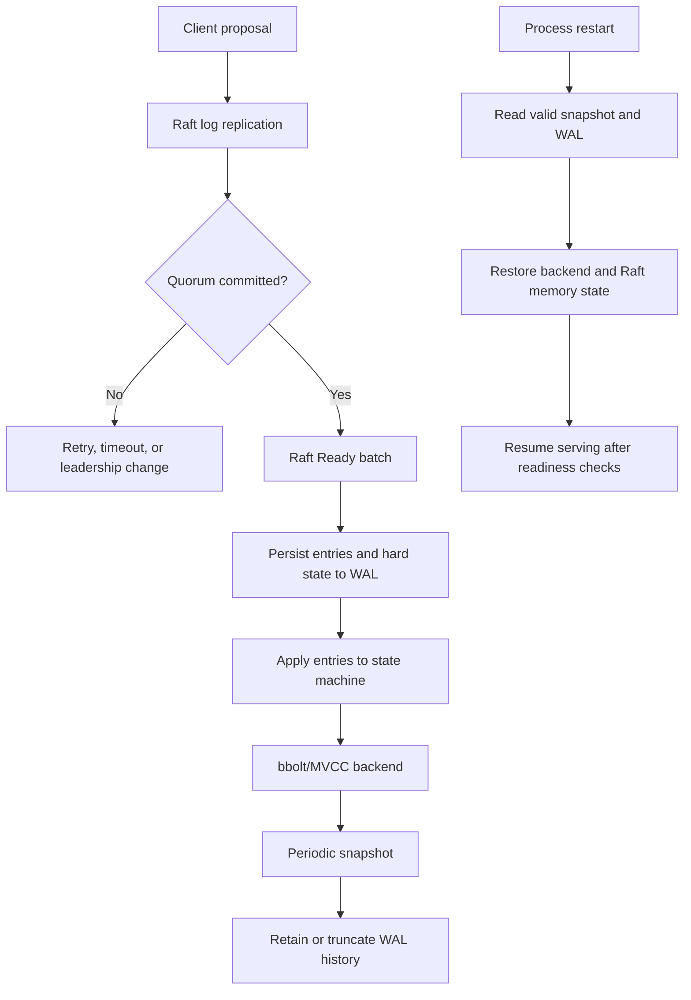

# Guide 3: Raft, storage, and recovery

This guide explains how etcd turns a replicated log into durable state and how a member restarts safely.

## Outcome

You should be able to distinguish proposed, committed, applied, and persisted data; explain the role of WALs and snapshots; and reason about restart and catch-up behavior.

## Concept links

- [Raft paper](https://raft.github.io/raft.pdf) — leader election, replication, commitment, and safety.
- [Write-ahead logging](https://en.wikipedia.org/wiki/Write-ahead_logging) — why durable log records precede application.
- [bbolt](https://github.com/etcd-io/bbolt) — embedded B+ tree database used by etcd.
- [etcd disaster recovery](https://etcd.io/docs/latest/op-guide/recovery/) — operational view of snapshots and restore.

## Step 1: learn the state vocabulary

Create a table with these columns: Raft term, log index, committed index, applied index, backend consistent index, MVCC revision, WAL segment, snapshot index. Fill it in while reading. These values are related but not interchangeable.

## Step 2: read the etcd Raft wrapper

Start with [server/etcdserver/raft.go](../server/etcdserver/raft.go). Focus on:

- the `raftNode` lifecycle and ticker;
- the `Ready()` loop;
- outgoing peer messages;
- `toApply` and `applyc`;
- read-state delivery;
- snapshot messages and advancement notifications.

Only after this should you inspect the external `go.etcd.io/raft/v3` implementation. Ask: what does the library emit, and what obligations does etcd have before applying it?

## Step 3: follow persistence ordering

Read [server/storage/storage.go](../server/storage/storage.go). Then inspect `server/storage/wal/` for WAL creation, segment rotation, hard-state writes, replay, and snapshot markers. Identify the code that persists Raft data before exposing it to the apply path.

The central mental model is:

```text
proposal -> Raft replication -> committed Ready
        -> durable WAL/hard state
        -> apply channel
        -> backend/MVCC state
```

### Durability and recovery flow



The upper path is the live write path: commitment is a quorum decision, persistence makes the member's Ready data durable, and application changes user-visible MVCC state. The separate restart path reconstructs compatible Raft and backend state from the latest valid snapshot and WAL before readiness is announced.

## Step 4: understand snapshots

Find snapshot creation and restore code in `server/storage/` and `server/etcdserver/`. A snapshot represents a compact starting point for the state machine; it lets a restarting or lagging member avoid replaying every historical entry.

Connect snapshot settings to behavior:

- `SnapshotCount` controls when Raft history is snapshotted;
- WAL retention controls how much replay history remains;
- MVCC compaction removes old logical revisions;
- backend defragmentation reclaims physical database space.

These are different forms of compaction and should not be conflated.

## Step 5: follow bootstrap and recovery

Read [server/etcdserver/bootstrap.go](../server/etcdserver/bootstrap.go). Trace how startup:

1. locates valid WAL snapshots;
2. reads hard state and entries;
3. opens or replaces the backend;
4. restores membership and consistent-index metadata;
5. creates the in-memory Raft storage;
6. resumes normal serving.

Pay special attention to checks comparing snapshot index, committed index, and backend consistent index. These checks prevent a member from claiming a state that its durable log cannot justify.

## Step 6: perform a restart experiment

```bash
./bin/etcd --data-dir ./tmp/etcd-recovery
./bin/etcdctl put durable yes
./bin/etcdctl endpoint status -w table
```

Stop the process, start it again with the same data directory, and run:

```bash
./bin/etcdctl get durable
./bin/etcdctl endpoint status -w table
```

Correlate the startup logs with WAL replay, backend opening, and readiness. The key observation is that the value survives because the applied state was backed by durable storage, not because the process kept memory alive.

## Step 7: observe a cluster

Use the root [Procfile](../Procfile) with Goreman to run a three-member local cluster. Repeatedly run:

```bash
./bin/etcdctl endpoint status --cluster -w table
```

Identify the leader, stop one member, write a key, restart it, and observe catch-up. Do not remove data directories during this experiment until you understand which member and directory you are targeting.

## Step 8: connect physical and logical durability

For one write, record:

- client response revision;
- leader term and committed index;
- applied index in logs/metrics;
- backend consistent index;
- WAL/snapshot files created or reused.

Explain which values are user-visible and which exist only to preserve correctness.

## Checkpoint

You should be able to explain why a committed entry is not necessarily already applied, why snapshots do not replace the backend, how a follower catches up, and which recovery invariant protects against state divergence after a crash.

## Common mistakes

- Treating a bbolt transaction as the replication mechanism; Raft decides order, then the apply path updates bbolt.
- Assuming a snapshot is merely a backup file; it is also a Raft/log truncation and recovery boundary.
- Mixing MVCC revision numbers with Raft log indexes.
- Testing only a clean shutdown; crash and leader-change behavior exercise different paths.
