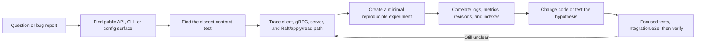

# Guide 4: validate understanding with tests and experiments

This guide turns your mental model into repeatable evidence for debugging and code changes.

## Outcome

You should be able to locate the contract for a behavior, select the smallest useful test, design a failure experiment, and explain a failure at the client, gRPC, Raft, apply, or backend boundary.

## Concept links

- [etcd testing guide](https://etcd.io/docs/latest/learning/testing/) — project testing strategy and terminology.
- [Go testing](https://go.dev/doc/tutorial/add-a-test) — focused tests and test packages.
- [Jepsen consistency models](https://jepsen.io/consistency) — vocabulary for distributed read/write behavior.
- [etcd monitoring](https://etcd.io/docs/latest/op-guide/monitoring/) — metrics, health, and operational signals.

## Step 1: run focused unit tests

Start with the package you are reading:

```bash
PASSES=unit PKG=./client/v3 ./scripts/test.sh
PASSES=unit PKG=./server/etcdserver ./scripts/test.sh
```

The test script defaults to read-only module mode and can enable the race detector on supported architectures. Read [scripts/test.sh](../scripts/test.sh) before changing its environment variables.

## Step 2: read tests as executable specifications

For every feature, locate tests in this order:

1. tests next to the implementation (`*_test.go`);
2. client examples and package integration tests;
3. `tests/integration/` for multi-component behavior;
4. `tests/e2e/` for built-binary behavior;
5. `tests/robustness/` for fault and model-based scenarios.

Record setup, action, expected response, revision/index assertions, and cleanup. This is more useful than collecting isolated function names.

## Step 3: build a behavior matrix

Use a small table such as:

| Scenario | Expected contract | Best first test |
|---|---|---|
| normal Put/Get | value and revision are returned | client KV tests |
| old revision after compaction | compacted error | MVCC/integration tests |
| leader unavailable | retry/timeout semantics are bounded | client retry + integration tests |
| follower stopped | quorum remains available with enough members | cluster integration tests |
| watch cancellation | stream closes without leaking | watch tests |
| lease expiry | attached keys disappear after TTL | lease/integration tests |

### Investigation loop



Each loop begins with a user-visible question and ends with evidence. If verification does not settle the question, return to the implementation trace with the new observations instead of stacking speculative changes.

## Step 4: run controlled experiments

### Leader interruption during a write

Run a three-member cluster. Start a write loop, stop the leader, and inspect whether each client call reports success, retry, or timeout. Compare the client result with the key’s eventual presence and revision. This teaches why write retries require careful semantics.

### Follower outage

Stop one follower and continue reads/writes. Then stop a second member and observe loss of quorum. Restore members and verify catch-up before declaring the cluster healthy.

### Compaction boundary

Write several revisions, compact an older revision, and request it:

```bash
./bin/etcdctl compact <revision>
./bin/etcdctl get learning --rev <old-revision>
```

Connect the error to MVCC history, not to missing current data.

### Watch and lease behavior

Attach a watch, write keys, and correlate emitted events with revisions. Grant a lease, attach a key, stop keepalive, and observe expiration. Read the corresponding client and server tests before interpreting timing.

## Step 5: use observability deliberately

Enable debug logging only when needed. Correlate:

- client endpoint and RPC errors;
- server request and authentication logs;
- Raft term/index/leader changes;
- apply and backend consistent indexes;
- metrics for proposals, commits, watches, leases, and gRPC latency.

Logs show evidence around an invariant; they do not replace reading the invariant in code.

## Step 6: expand validation gradually

After focused tests pass:

```bash
make test-integration
make test-e2e
make verify
```

Use `make test-robustness` for failure-oriented behavior and `make test-coverage` when you need to see which paths your experiment exercised. Broad suites can be slow; keep the focused command that reproduces the behavior in your notes.

## Step 7: investigate a change like a maintainer

For a new feature or bug:

1. Start at its public surface: protobuf RPC, client method, CLI command, or config flag.
2. Find the test that defines current behavior.
3. Trace the implementation through gRPC and either proposal/apply or read-index.
4. Identify persistence and restart implications.
5. Add or adjust the narrowest test that proves the behavior.
6. Run focused tests, then integration/e2e tests for cross-process effects.
7. Finish with repository verification if generated code, dependencies, or shared contracts changed.

## Step 8: write your own explanation

For each investigation, produce a one-page note containing:

- the user-visible behavior;
- source files and boundaries;
- relevant invariants;
- failure modes and expected errors;
- tests and commands used as evidence;
- unresolved assumptions.

If a claim cannot be tied to code, a test, or a reproducible experiment, label it as an assumption and keep investigating.

## Checkpoint

You are ready to work independently when you can take an unfamiliar change, predict its affected modules, choose focused tests, reproduce a failure, and explain whether the fault is in client behavior, transport, leadership/quorum, apply logic, or durable state.
