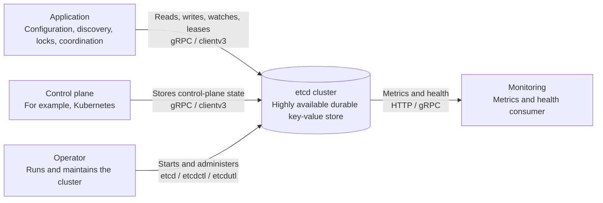
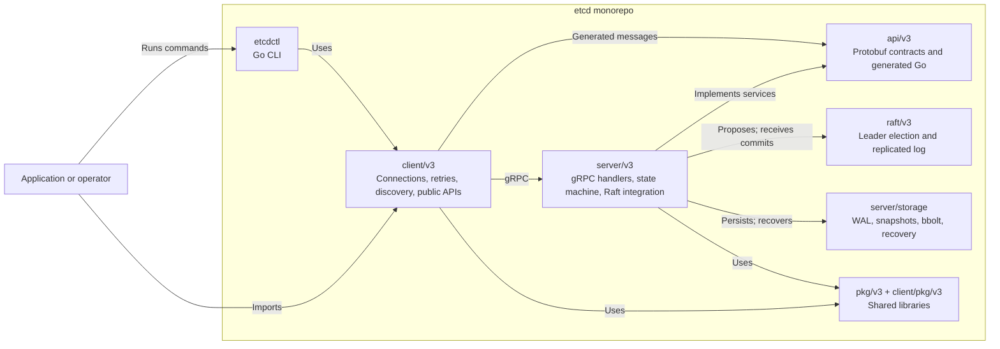
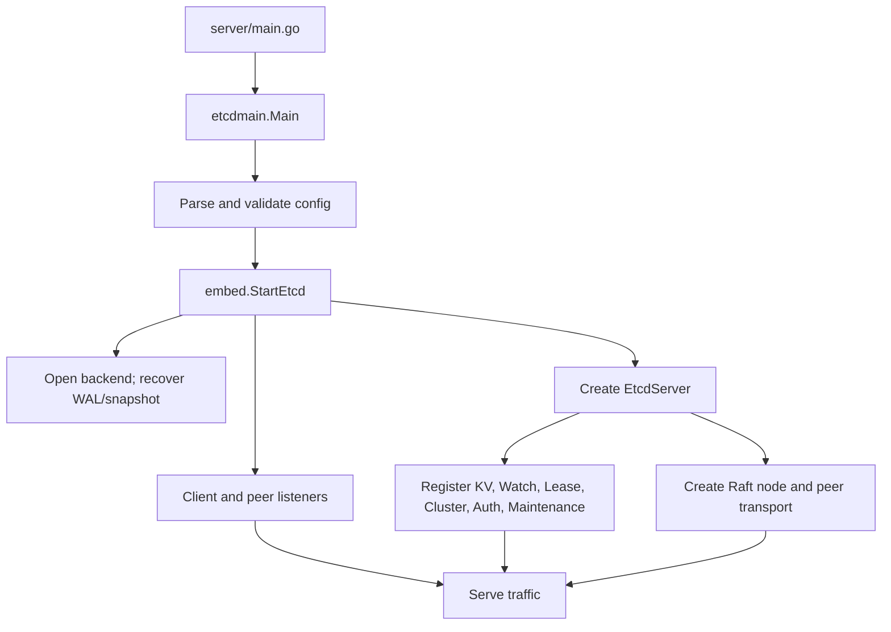
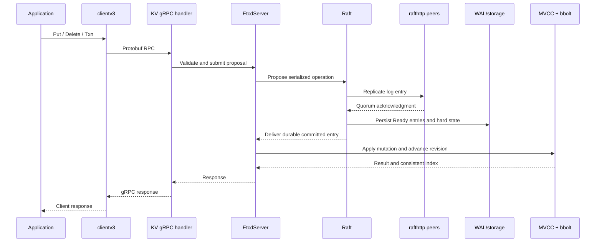
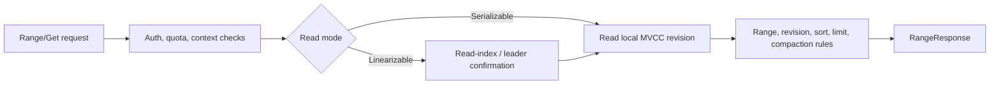
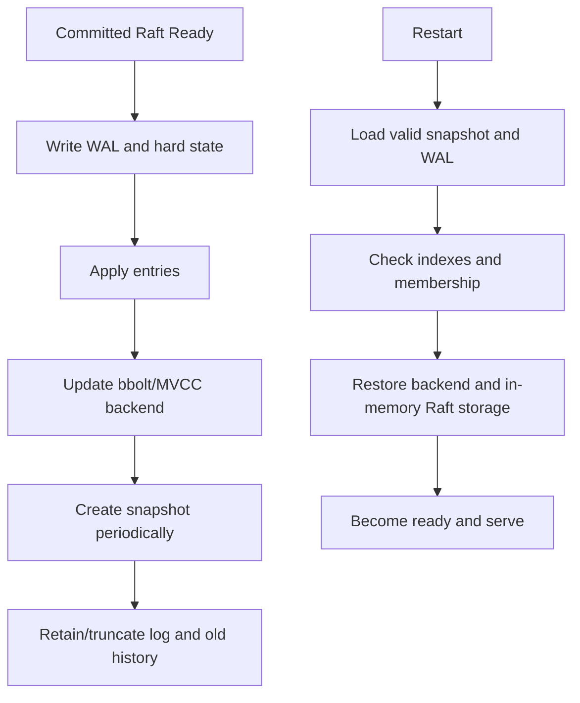

# etcd architecture reference

This document is a structural map of the repository and the running system. Use it when you need to decide which module owns a behavior, where data moves, or where to begin reading a change.

## 1. Architecture in one sentence

etcd exposes a versioned gRPC API, accepts requests through a client-facing server, orders state-changing operations with Raft, applies committed operations to an MVCC key-value state machine, and persists the result with a WAL, snapshots, and a bbolt backend.

Useful background: [etcd’s architecture rationale](https://etcd.io/docs/latest/learning/why/), [the Raft paper](https://raft.github.io/raft.pdf), and the repository’s [module guide](../Documentation/contributor-guide/modules.md).

## 2. C4 system context



Client traffic normally uses port 2379. Member-to-member Raft and snapshot traffic normally uses port 2380.
The diagram shows only actors outside the cluster; peer traffic between members is an internal concern and therefore does not appear in this context view.

## 3. C4 container view of repository modules



Arrows show runtime use or dependency direction, not Go-module ownership. In particular, `api/v3` defines the shared wire contract: clients consume its generated stubs and the server implements its generated service interfaces.

## 4. Module responsibilities and usage

| Module/directory | What it owns | Who uses it | Read first |
|---|---|---|---|
| `api/` | `.proto` definitions and generated RPC/message types | `client/v3`, `server`, `etcdctl`, external clients | `api/etcdserverpb/`, `api/mvccpb/` |
| `client/pkg/` | TLS/transport, logging, types, and lightweight client helpers | `client/v3`, applications | `client/pkg/transport/`, `client/pkg/types/` |
| `client/v3/` | Public Go client API, gRPC connection lifecycle, endpoint resolver, retries, watches, leases, auth, transactions | External Go applications and `etcdctl` | `client/v3/client.go`, `kv.go`, `watch.go` |
| `pkg/` | Shared utilities that should not depend heavily on the server | Client and server modules | package directories under `pkg/` |
| `server/config/` | Flags, defaults, validation, TLS, data and cluster settings | `server/embed`, `server/etcdmain` | config types and validation methods |
| `server/embed/` | Embedded server construction and lifecycle | `etcd` binary and embedding applications | `server/embed/etcd.go` (`StartEtcd`) |
| `server/etcdmain/` | `etcd` command startup and mode selection | `server/main.go` | `server/etcdmain/main.go` |
| `server/etcdserver/` | Core member state machine and request coordination | gRPC services, Raft loop, storage | `server.go`, `raft.go`, `apply/`, `read/`, `txn/` |
| `server/etcdserver/api/v3rpc/` | gRPC service implementations, interceptors, metrics, tracing | `embed` listeners and clients | `grpc.go` and service files |
| `server/etcdserver/api/rafthttp/` | Peer message and snapshot transport | Raft integration | transport implementations |
| `server/storage/` | WAL, snapshots, backend opening, recovery, and consistency checks | `etcdserver`, `etcdutl` | `storage.go`, `wal/`, `backend.go` |
| `etcdctl/` | CLI command tree and human-readable output | Operators and scripts | `ctlv3/ctl.go`, `ctlv3/command/` |
| `etcdutl/` | Offline maintenance and storage inspection | Operators handling data files | `ctl.go`, `snapshot/`, `etcdutl/` |
| `tests/` | Cross-module integration, e2e, and robustness tests | CI and contributors | `tests/integration/`, `tests/e2e/`, `tests/robustness/` |
| `tools/` | Build, release, diagnostics, benchmark, and analysis tools | Contributors and CI | tool-specific `README`/`main.go` files |

The exact workspace membership is authoritative in [go.work](../go.work). Module versions and local development replacements are in the individual `go.mod` files.

## 5. Server internals

### 5.1 Startup and lifecycle



`StartEtcd` returns an object whose `ReadyNotify()` channel is the readiness boundary for embedding code. A process can have listeners before it has fully joined or recovered its cluster state.
The branches inside `StartEtcd` are concurrent setup responsibilities, not a claim that every box completes in the displayed top-to-bottom order. Serving becomes useful only after listeners, service registration, and Raft initialization converge at the readiness boundary.

### 5.2 Core state-machine components

- **API adapters** translate protobuf requests and responses.
- **Authentication and authorization** decide whether a request may run.
- **Read path** handles serializable local reads and linearizable read-index reads.
- **Transaction path** evaluates comparisons and executes success/failure operations atomically.
- **Lease path** tracks TTLs and key attachment.
- **Watch path** publishes revisioned events generated by applied changes.
- **Membership path** manages members, learners, and configuration changes.
- **Apply path** converts committed Raft entries into state-machine effects.
- **Consistent index** connects applied backend state to the Raft log position that justifies it.

The package boundaries are visible below `server/etcdserver/`; follow interfaces first, then implementations.

## 6. Data-flow diagrams

### 6.1 Write path



Raft decides the order and commitment of the operation; it does not mutate the key-value database. The local member saves the Ready data before the committed entry reaches the apply path, and the RPC completes only after application produces the matching result.

### 6.2 Read path



The client API is documented in the [etcd API guide](https://etcd.io/docs/latest/learning/api/). Historical reads depend on MVCC history and can fail after compaction.
A serializable read may use the member's current local state. A linearizable read first confirms that the member has applied through an authoritative read index, then both modes use the same MVCC range machinery.

### 6.3 Persistence and recovery



The upper path describes normal operation; the lower path describes restart. A Raft snapshot and the bbolt backend have different roles: the snapshot bounds log replay, while the backend stores the applied MVCC state.

Read [server/storage/storage.go](../server/storage/storage.go), [server/storage/wal/](../server/storage/wal/), and [server/etcdserver/bootstrap.go](../server/etcdserver/bootstrap.go) together. The ordering between these components is more important than any single file.

## 7. Dependency direction

The intended dependency direction is:

```text
external application
        ↓
client/v3 → api/v3 → generated protobuf/gRPC
        ↓                    ↑
   client/pkg/v3       server/v3
                             ↓
                     raft/v3 + pkg/v3
                             ↓
                    server/storage + bbolt
```

Keep public modules lightweight. In particular, avoid putting server-specific code into `client/pkg` or `pkg` when it would pull the server dependency graph into external applications.

## 8. How to use this map when changing code

1. Start at the public surface: protobuf RPC, client method, CLI command, or config flag.
2. Identify whether the behavior is a write, a linearizable read, a serializable read, a watch event, a lease action, or membership change.
3. Follow the matching server adapter into `EtcdServer`.
4. For writes, cross the proposal → commit → apply boundary before inspecting backend code.
5. For reads, identify the consistency mode and revision source before changing query logic.
6. Check WAL, snapshot, restart, and multi-member implications for every state change.
7. Find the closest unit test, then the integration/e2e test that exercises process boundaries.

## 9. Where to read next

- [Guide 1: orientation and architecture](01-orientation-and-architecture.md)
- [Guide 2: request path](02-request-path.md)
- [Guide 3: Raft and storage](03-raft-and-storage.md)
- [Guide 4: tests and experiments](04-tests-and-experiments.md)
- [etcd operational documentation](https://etcd.io/docs/latest/op-guide/)
- [etcd contributor documentation](../Documentation/contributor-guide/)
