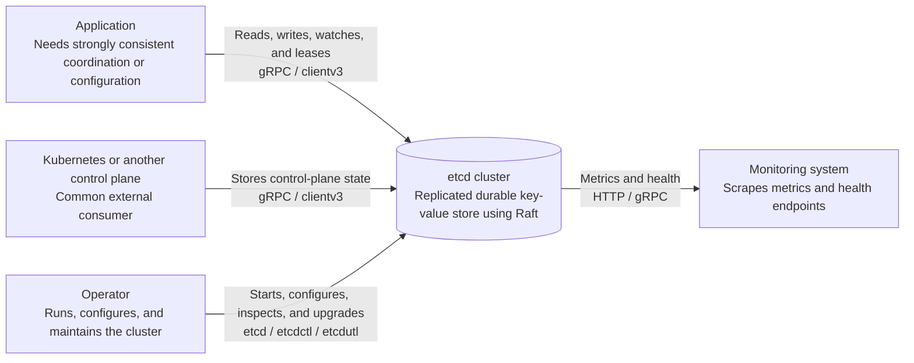
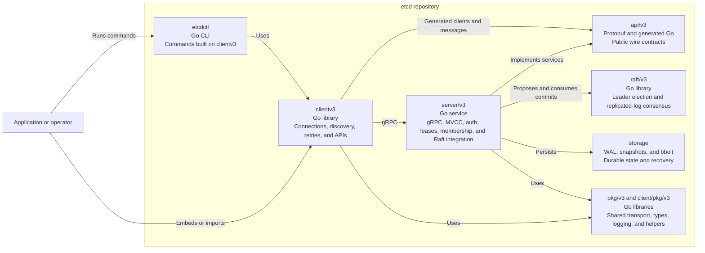
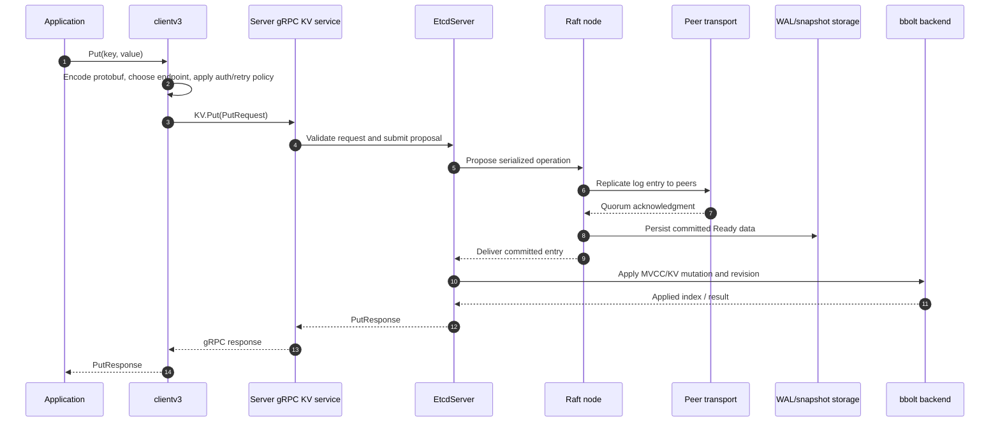

# etcd repository guide

This guide is a code-oriented introduction to this repository. It explains what each major module owns, how a request travels through a running cluster, and a reading order that avoids getting lost in implementation detail.

## 1. What the project is

etcd is a distributed, durable key-value store. Clients use a versioned gRPC API; server members replicate changes with the Raft consensus algorithm; each member persists a write-ahead log (WAL), snapshots, and a bbolt-backed key-value database. The public overview and ports are documented in [README.md](../README.md).

The repository is a single Git checkout but a Go workspace containing multiple modules. The workspace definition is in [go.work](../go.work), while the root [go.mod](../go.mod) provides local `replace` directives so modules can be developed together.

At a high level:

```text
etcdctl / clientv3
          |
       gRPC API (protobuf definitions + generated code)
          |
  server gRPC handlers / HTTP gateway
          |
  EtcdServer: auth, MVCC, leases, transactions, watches
          |
  Raft proposal -> replicated commit -> apply loop
          |
  WAL + snapshots + bbolt backend
```

## 1.1 C4 architecture views

These diagrams use Mermaid flowchart and sequence syntax. They are intentionally scoped to the concepts a newcomer needs first; implementation details remain in the file-by-file sections below.

### C4 Level 1 — system context



This context view keeps the cluster as one system. Applications and control planes use the client API, operators manage the cluster through its binaries, and monitoring systems consume operational endpoints.

### C4 Level 2 — containers and repository modules



This view opens the repository boundary. `api/v3` is the shared contract, `client/v3` and `etcdctl` are callers, and `server/v3` coordinates consensus and storage without exposing those internals directly to clients.

### Write path — sequence view



The sequence separates commitment from application: Raft first establishes the replicated order, the member persists Ready data, and only then does the apply path update MVCC state and release the waiting response.

For reads, replace the proposal/replication portion with the server read-index or serializable-read path, then follow the revision query into the backend. Watches observe events emitted by the apply path; leases and transactions add state machines around the same proposal/apply boundary.

## 2. Repository map

### Public Go modules

The rationale for these modules is also recorded in [Documentation/contributor-guide/modules.md](../Documentation/contributor-guide/modules.md).

| Directory | Module | Responsibility | Start here |
|---|---|---|---|
| `api/` | `go.etcd.io/etcd/api/v3` | Protobuf schemas and generated gRPC/HTTP API types: KV, Watch, Lease, Cluster, Auth, Maintenance, alarms, and version messages. | `api/etcdserverpb/`, `api/mvccpb/`, `api/v3rpc/` |
| `client/pkg/` | `go.etcd.io/etcd/client/pkg/v3` | Lightweight client-side shared utilities (transport, TLS, logging, types, file/path helpers). Kept small so applications can depend on it safely. | `client/pkg/transport/`, `client/pkg/types/` |
| `client/v3/` | `go.etcd.io/etcd/client/v3` | Network client library. Builds requests, maintains gRPC connections and endpoint discovery, retries safely, and exposes KV/Watch/Lease/Auth/Cluster/Maintenance interfaces. | `client/v3/client.go`, `client/v3/kv.go`, `client/v3/watch.go` |
| `pkg/` | `go.etcd.io/etcd/pkg/v3` | General-purpose etcd utilities shared by server and clients (cobra helpers, wait groups, logging, runtime/debug helpers, file utilities). | package directories under `pkg/` |
| `server/` | `go.etcd.io/etcd/server/v3` | The implementation of an etcd member: configuration, embedding, networking, gRPC services, Raft integration, MVCC, auth, leases, storage, and proxy support. | `server/main.go`, `server/etcdmain/`, `server/embed/` |
| `etcdctl/` | `go.etcd.io/etcd/etcdctl/v3` | Human-facing CLI for the v3 API: get/put/delete/txn, watch, lease, member, endpoint, auth, snapshot, and maintenance commands. | `etcdctl/main.go`, `etcdctl/ctlv3/ctl.go`, `etcdctl/ctlv3/command/` |
| `etcdutl/` | `go.etcd.io/etcd/etcdutl/v3` | Offline/local administration: defrag, snapshot inspection, hash, migration, completion, and bbolt-oriented utilities. | `etcdutl/ctl.go`, `etcdutl/etcdutl/`, `etcdutl/snapshot/` |
| `tests/` | `go.etcd.io/etcd/tests/v3` | Cross-module integration, end-to-end, robustness, and common test support. Unit tests normally live beside the package they test. | `tests/integration/`, `tests/e2e/`, `tests/robustness/` |

The workspace also includes `cache/` (client/server caching helpers), `tools/` (release, diagnostics, benchmark, protobuf, and test-grid tools), and several tool-only Go modules listed in `go.work`.

### Server submodules

Inside `server/`, think in layers:

- `etcdmain/`: command-line startup and mode selection. The tiny `server/main.go` wrapper calls `etcdmain.Main`.
- `embed/`: constructs and starts an in-process etcd member, listeners, handlers, and lifecycle management. `StartEtcd` is the main embedding entry point.
- `config/`: server flags, defaults, validation, TLS, data directory, and cluster bootstrap settings.
- `etcdserver/`: the core member state machine. Important areas include `api/` (HTTP/gRPC-facing adapters), `apply/` (committed request application), `read/` (linearizable/read-index paths), `txn/`, `lease/`, `auth/`, `membership/`, `cindex/`, and `server.go`.
- `etcdserver/api/v3rpc/`: gRPC service implementations and interceptors. Registration is centralized in `grpc.go`.
- `etcdserver/api/rafthttp/`: peer-to-peer Raft message and snapshot transport.
- `storage/`: WAL and snapshot coordination, including recovery and persistence ordering.
- `mvcc/`-style functionality is represented through server packages and the bbolt backend; follow the apply and backend interfaces when tracing data changes.
- `proxy/`: optional HTTP/gRPC proxy behavior; `features/`, `verify/`, and `mock/` support compatibility, validation, and tests.

## 3. Executables and entry points

There are three primary user-facing binaries:

1. `etcd`: [server/main.go](../server/main.go) delegates to [server/etcdmain/main.go](../server/etcdmain/main.go). `etcdmain.Main` handles architecture checks, proxy subcommands, and normal server startup. The normal startup path eventually calls the embedding layer.
2. `etcdctl`: [etcdctl/main.go](../etcdctl/main.go) calls `ctlv3.MustStart`. [etcdctl/ctlv3/ctl.go](../etcdctl/ctlv3/ctl.go) creates the Cobra root command, global connection/TLS/auth flags, and all subcommands.
3. `etcdutl`: [etcdutl/ctl.go](../etcdutl/ctl.go) registers offline maintenance commands such as snapshot, defrag, hash, migrate, and bbolt commands.

Useful secondary entry points are `server/embed.StartEtcd` for embedding, `client/v3.New` for creating a network client, and `v3rpc.Server` for constructing the gRPC server.

## 4. Step-by-step request lifecycle

### A. Startup

1. The `etcd` binary enters `server/main.go` and calls `etcdmain.Main`.
2. `etcdmain` parses the mode and configuration, then starts the normal etcd server path.
3. `embed.StartEtcd` validates configuration, creates peer listeners (default peer port 2380) and client listeners (default client port 2379), prepares the server configuration, and initializes the member.
4. Bootstrap/recovery code opens the backend, reads the WAL and latest snapshot, reconstructs the Raft state, and determines whether the member is new or restarting.
5. The server creates a gRPC server with `server/etcdserver/api/v3rpc/grpc.go`. It registers KV, Watch, Lease, Cluster, Auth, Health, and Maintenance services, plus metrics/tracing/interceptors.
6. Peer transport (`rafthttp`) and client HTTP/gRPC listeners start. `ReadyNotify()` is the readiness boundary for embedded callers.

### B. A write (`Put`, `Delete`, or `Txn`)

1. Application code calls `clientv3.Put`, `Delete`, or `Txn`; these are implemented in `client/v3/kv.go` and `client/v3/txn.go`.
2. The client converts the operation to an API protobuf request and sends it through the generated `KVClient` over gRPC. The client wrapper adds endpoint balancing, authentication, deadlines, and write-at-most-once retry rules.
3. The server-side KV gRPC implementation validates context, authentication, quotas, request size, and operation semantics, then hands the request to `EtcdServer`.
4. The leader serializes the operation into a Raft proposal. Raft replicates the entry to a quorum through the peer transport.
5. Once committed, the Raft node emits `Ready` data. The etcd Raft loop persists hard state/entries and sends committed entries to the apply channel.
6. `EtcdServer.apply` (see `server/etcdserver/server.go`) processes each committed entry. The apply layer executes KV, transaction, lease, auth, membership, and compaction effects against the backend and updates revision/consistent-index bookkeeping.
7. The waiting proposal receives the corresponding response. The gRPC handler returns the protobuf response to the client.
8. Followers apply the same committed log entry, producing the same logical state. Periodic snapshots compact the Raft log and backend history; WAL and snapshot ordering is coordinated by `server/storage/`.

### C. A read (`Get`/Range)

1. `clientv3.Get` builds a `RangeRequest`.
2. The server must provide the requested consistency. A linearizable read uses the leader/read-index path so the member confirms its position in the committed Raft log before reading.
3. The read layer queries the MVCC/backend state at the requested revision, applies range boundaries, sorting, limits, and filters, and returns a `RangeResponse`.
4. Historical revisions can be rejected after compaction. Streaming ranges use the gRPC `RangeStream` method and deliver chunks.

### D. Watches, leases, and transactions

- Watches subscribe to revision events generated by applied writes; inspect `client/v3/watch.go` and the server watch API.
- Leases associate TTLs with keys and are kept alive by client goroutines; inspect `client/v3/lease.go` and `server/lease/`.
- Transactions contain compare conditions plus success/failure operation lists. Follow `client/v3/txn.go` into the server transaction/apply code.

## 5. Persistence and recovery mental model

Each member has a data directory (normally `default.etcd/`) with a backend database and a WAL directory. The important invariants are:

- Raft entries are durably persisted before the node treats them as safe to apply.
- The backend carries a consistent index linking applied state to the Raft log.
- Snapshots allow a member to restart or catch up without replaying the entire history.
- Recovery chooses a valid WAL snapshot, restores/reopens the backend when needed, then resumes Raft from the recovered hard state and log.

Read `server/storage/storage.go`, `server/storage/wal/wal.go`, and `server/etcdserver/bootstrap.go` together; reading only the bbolt code hides the ordering guarantees that make replication safe.

## 6. How to build, run, and test while learning

Use Go 1.26 (the version is declared in `go.work` and each module). Typical commands from the repository root are:

```bash
# Build etcd and its normal binaries
make build

# Build all workspace packages and run the default test passes
make test

# Faster focused checks
make test-unit
PASSES=unit PKG=./server/etcdserver ./scripts/test.sh

# Run static checks and consistency validation
make verify
```

For a first manual experiment, build/run `etcd`, then use `etcdctl put mykey value` and `etcdctl get mykey`. For cluster behavior, the root `Procfile` starts a three-member local cluster through Goreman. Keep client port 2379 and peer port 2380 distinct when reading logs or configuration.

## 7. Recommended reading path

Follow this order and keep the referenced source files open:

1. Read [README.md](../README.md) and [modules.md](../Documentation/contributor-guide/modules.md) to learn the vocabulary and module boundaries.
2. Read [go.work](../go.work) and each module's `go.mod` to see dependency direction. Start with `api`, then `client/pkg`, `client/v3`, `pkg`, and finally `server`.
3. Trace startup: `server/main.go` -> `server/etcdmain/main.go` -> `server/embed/etcd.go`.
4. Trace the public protocol: `api/etcdserverpb` generated interfaces -> `server/etcdserver/api/v3rpc/grpc.go` registrations -> concrete service files beside it.
5. Trace one write end to end: `client/v3/kv.go` -> KV gRPC handler -> proposal code in `server/etcdserver` -> `server/etcdserver/raft.go` -> `EtcdServer.apply` -> backend.
6. Trace one read separately, including read-index/linearizability and revision/compaction behavior.
7. Study durability: `server/storage/storage.go`, `server/storage/wal/`, snapshots, and `server/etcdserver/bootstrap.go`.
8. Add cross-cutting concerns: auth, leases, watch delivery, quotas, metrics, tracing, and membership changes.
9. Read tests next to the code, then cross-module tests under `tests/integration` and `tests/e2e`. Tests are often the clearest executable specification.
10. Only after that, explore proxies, migration tools, release scripts, and specialized diagnostics under `tools/`.

## 7.1 Four-guide investigation plan

Use these guides in order. Do not try to read the entire repository linearly: each guide gives you a small experiment, a focused source path, and a checkpoint that tells you whether to continue.

For standalone, detailed versions of these guides, use:

1. [Guide 1 — orientation and architecture](01-orientation-and-architecture.md)
2. [Guide 2 — trace the request path](02-request-path.md)
3. [Guide 3 — Raft, storage, and recovery](03-raft-and-storage.md)
4. [Guide 4 — tests and experiments](04-tests-and-experiments.md)

### Guide 1 — Build a runnable mental model

Goal: explain what exists, how it starts, and where the public boundaries are.

1. Read the project overview in [README.md](../README.md), then read [contributor-guide/modules.md](../Documentation/contributor-guide/modules.md). Write down the roles of `api`, `client/v3`, `server`, `etcdctl`, `etcdutl`, and `tests` in your own words.
2. Inspect [go.work](../go.work) and the root [go.mod](../go.mod). Note which directories are Go modules and which modules depend on local replacements.
3. Start with the smallest executable path: [server/main.go](../server/main.go) → [server/etcdmain/main.go](../server/etcdmain/main.go) → `embed.StartEtcd` in [server/embed/etcd.go](../server/embed/etcd.go).
4. Build the binaries with `make build`. Run a single member and observe its client and peer listeners:

   ```bash
   ./bin/etcd
   # in another terminal
   ./bin/etcdctl endpoint status
   ```

5. Sketch the runtime objects: configuration, listeners, `EtcdServer`, gRPC services, Raft node, backend, WAL, and snapshotter.

Checkpoint: you should be able to answer “which binary starts first?”, “which package owns configuration?”, “where are gRPC services registered?”, and “which module would an external Go application import?”. If not, repeat steps 2–3 before moving on.

### Guide 2 — Trace one write and one read

Goal: follow user-visible operations across the network boundary and the server state machine.

1. Start from the client interface in [client/v3/kv.go](../client/v3/kv.go). Read `Put`, `Get`, `Delete`, and `Do`; then inspect operation encoding in [client/v3/op.go](../client/v3/op.go).
2. Find the generated RPC contracts in `api/etcdserverpb/` and the server registration in [server/etcdserver/api/v3rpc/grpc.go](../server/etcdserver/api/v3rpc/grpc.go).
3. Put a key and capture the revision returned by etcdctl:

   ```bash
   ./bin/etcdctl put learning "first value"
   ./bin/etcdctl get learning -w json
   ```

4. Trace the write into `EtcdServer`: identify the proposal submission, the request ID/wait channel used to match a committed entry with its caller, and the apply function that changes state. Search for `apply(` and follow [server/etcdserver/server.go](../server/etcdserver/server.go).
5. Trace the read separately. Identify the linearizable read-index path versus a serializable/local read, then follow revision, range, sorting, and compaction checks into the backend query.
6. Repeat with a transaction:

   ```bash
   ./bin/etcdctl txn <<'EOF'
   value learning = "first value"
   put learning "updated"
   get learning
   EOF
   ```

7. Draw two flows: “write becomes durable and visible” and “read is authorized to observe a revision”. Mark where authentication, quotas, retries, and deadlines are applied.

Checkpoint: you should be able to explain why a successful `Put` means a quorum-committed operation, why a `Get` may need a read-index round trip, and why the client must not blindly retry every failed write.

### Guide 3 — Understand Raft, storage, and recovery

Goal: understand how a member survives crashes and why all healthy members converge on the same state.

1. Read the Raft integration in [server/etcdserver/raft.go](../server/etcdserver/raft.go). Focus on the `Ready` loop, ticks, messages, snapshots, `applyc`, and advancement notifications.
2. Read the generic consensus implementation in the external `go.etcd.io/raft/v3` dependency only after you understand the etcd wrapper. Keep the question narrow: “what does etcd receive from Raft, and what must it persist before applying?”
3. Follow persistence through [server/storage/storage.go](../server/storage/storage.go), then inspect `server/storage/wal/` for segment creation, hard-state writes, replay, and snapshot markers.
4. Follow startup recovery in [server/etcdserver/bootstrap.go](../server/etcdserver/bootstrap.go). Identify how the latest valid WAL snapshot, hard state, Raft log, and backend consistent index are selected.
5. Run a restart experiment:

   ```bash
   ./bin/etcd --data-dir ./tmp/etcd-learning
   ./bin/etcdctl put durable yes
   # stop etcd, start it again with the same --data-dir
   ./bin/etcdctl get durable
   ```

6. Run a three-member cluster from [Procfile](../Procfile) when you are ready. Observe leader changes with `etcdctl endpoint status` and inspect peer traffic/logs while writing keys.
7. Study snapshot and compaction behavior only after the basic restart path is clear. Connect `SnapshotCount`, WAL retention, MVCC compaction, and backend defragmentation to their operational effects.

Checkpoint: you should be able to distinguish a Raft log entry, a committed entry, an applied entry, a backend revision, a WAL record, and a snapshot. You should also be able to state the recovery invariant that prevents the backend from claiming an index newer than the durable Raft state.

### Guide 4 — Prove your understanding with tests and experiments

Goal: turn the mental model into evidence you can reproduce when debugging or changing code.

1. Run the smallest tests first:

   ```bash
   PASSES=unit PKG=./server/etcdserver ./scripts/test.sh
   PASSES=unit PKG=./client/v3 ./scripts/test.sh
   ```

2. Read tests beside the implementation. Start with `client/v3/*_test.go`, server package tests, then cross-module scenarios under `tests/integration/` and `tests/e2e/`.
3. For a feature, locate the test that defines its contract before reading every implementation detail. Record setup, request, expected response, revision/index assertions, and cleanup.
4. Create a tiny experiment matrix. Examples:

   - kill the leader during a write and check whether the client reports success or retries;
   - stop a follower and verify quorum behavior;
   - request an old revision after compaction and observe the error;
   - attach a watch, write keys, and correlate watch events with applied revisions;
   - grant a lease, attach a key, stop keepalive, and observe expiration.

5. Use logs and metrics as observability clues, not as the source of truth. Correlate client request IDs/revisions with Raft terms/indexes and backend consistent indexes.
6. Run broader validation after focused tests pass:

   ```bash
   make test-integration
   make test-e2e
   make verify
   ```

7. Write a one-page explanation of the path you investigated, including file names, invariants, failure modes, and tests. If you cannot connect a claim to either code or a reproducible test, mark it as an assumption and investigate further.

Checkpoint: you should be able to take an unfamiliar change, identify its API surface, predict the affected server and persistence layers, choose the right focused tests, and explain what a failure means at the client, Raft, or backend boundary.

#### Optional specializations after the four guides

Once the core is comfortable, branch into one area at a time: authentication (`server/auth`, `client/v3/auth.go`), watches, leases, membership/reconfiguration, gRPC/HTTP proxying, observability, performance, or release/upgrade tooling. Each specialization should reuse the same method: start at the public surface, trace proposal/apply or read-index behavior, inspect persistence implications, then confirm with tests.

## 8. How to investigate a new feature or bug

Start from the externally visible surface: a protobuf RPC, a client method, a CLI command, or a configuration flag. Find its generated/API definition, then locate the server implementation and the test that asserts behavior. Follow the data across the proposal/apply boundary rather than jumping directly into Raft internals. Finally check persistence, restart, and multi-member tests; distributed bugs frequently appear only at those boundaries.

When changing code, run the smallest relevant package test first, then the corresponding integration suite, and finish with `make verify` when dependency, generated-code, or repository-wide behavior may be affected.

## 9. Common traps

- `api/` contains generated files; change the source `.proto` and regenerate instead of hand-editing generated Go.
- The root is not a single isolated Go module. A package may compile through workspace replacements while a published module has different dependency constraints.
- A successful local read is not automatically linearizable; identify whether the code uses read-index or a serializable local read.
- The Raft log is not the user-facing database. Proposals become visible state only after the apply path updates the backend/MVCC layer.
- `etcdctl` is a client of the network API; `etcdutl` performs local/offline operations and therefore has different safety assumptions.

This document is intentionally a map rather than a substitute for the design and operational guides in `Documentation/`. Use it to choose the next file to read, then validate your understanding by running a small cluster and correlating client commands, Raft logs, backend state, and tests.
