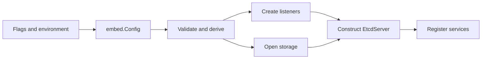

# Lesson 02: Embedding and Configuration

## Goal

Learn how configuration becomes listeners, services, data paths, TLS behavior,
and lifecycle coordination.

## Important files

- [embed/config.go](../embed/config.go)
- [embed/etcd.go](../embed/etcd.go)
- [embed/serve.go](../embed/serve.go)
- [config/config.go](../config/config.go)
- [storage/datadir/datadir.go](../storage/datadir/datadir.go)

## Configuration flow

Read embed/config.go in this order: defaults; URL and address parsing; TLS and
discovery; data-directory and cluster-state settings; validation; derived
values.

Configuration determines client URLs, peer URLs, metrics, TLS, timing, request
limits, initial-cluster behavior, and data locations. Bad derived values can
fail startup before Raft begins, so startup debugging starts here.

## Construction flow

embed/etcd.go composes the instance. Follow listener creation, storage opening,
core-server bootstrap, API installation, and background loops. Services must
not advertise readiness before state is safe to serve.

## Endpoint separation

embed/serve.go connects HTTP and gRPC handlers to listeners. Keep client
traffic and peer traffic separate: clients make requests; peers exchange Raft
and snapshot communication.

## Exercise

Pick a data directory and one client URL. Trace each value from its config field
to the code that consumes it. Identify one immediate and one startup-time
validation.

## Checkpoint

Why is embedding a lifecycle responsibility rather than merely a constructor?

## Useful tests

- [config_test.go](../embed/config_test.go) covers defaults, URLs, and config
  validation.
- [serve_test.go](../embed/serve_test.go) covers serving and bootstrap errors.
- [util_test.go](../embed/util_test.go) covers initialization detection.
- [config_test.go](../config/config_test.go) covers lower-level server config.

## Construction diagram

## File-by-file guide

### embed/config.go

This is the user-facing configuration model. Read defaults, URL parsing, TLS,
data-directory fields, and validation in that order. Defaults and derived URLs
are startup behavior; changing them changes exposed network surfaces.

### embed/etcd.go

This file owns the embedded instance. Follow its fields to see listeners,
backend, core EtcdServer, gRPC services, and close signals. Read start and
close together: every acquired resource needs a matching shutdown path.

### embed/serve.go

This connects listeners to HTTP and gRPC handlers. Track client traffic, peer
traffic, metrics, CORS, and request logging. It is an adapter, not the KV state
machine.

### config/config.go

This lower layer validates cluster URLs, timing, data paths, and request-size
calculations. It contains invariants that must hold before core construction.

### storage/datadir/datadir.go

This centralizes how one data directory becomes member, WAL, snapshot, and
backend paths. It prevents bootstrap and maintenance code from disagreeing on
the on-disk layout.
