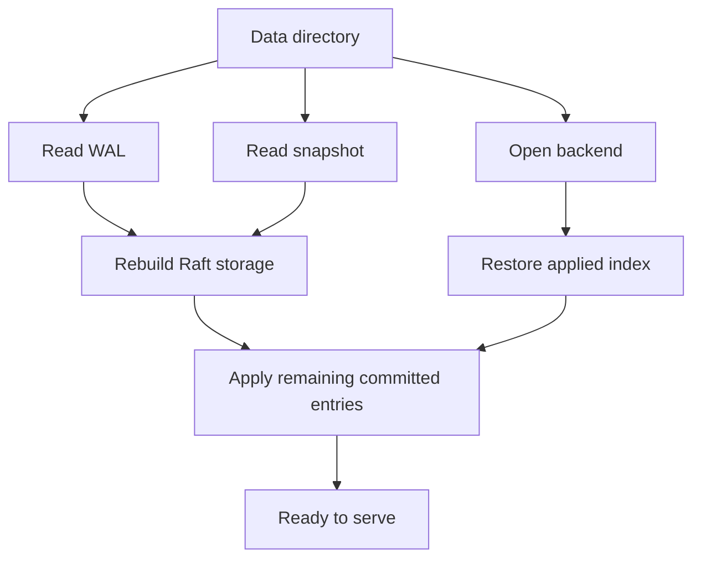

# Lesson 03: Bootstrap and Recovery

## Goal

Understand how a fresh node and a restarted node enter the same running-server
architecture.

## Important files

- [etcdserver/bootstrap.go](../etcdserver/bootstrap.go)
- [storage/storage.go](../storage/storage.go)
- [storage/backend.go](../storage/backend.go)
- [storage/datadir/datadir.go](../storage/datadir/datadir.go)
- [etcdserver/api/membership/](../etcdserver/api/membership/)

## Startup questions

Bootstrap must determine whether this is a new or existing member, what Raft
state and entries were recorded, and what logical database state was applied.
bootstrap.go converts those facts into the objects needed by the lifecycle.

## Conceptual sequence

~~~text
data directory -> locate WAL/snapshot -> read hard state and entries
               -> open backend -> restore membership/index
               -> create Raft storage/node -> construct server
~~~

Label each operation as recovery, initialization, or composition. This makes a
large startup function easier to understand.

## Fresh and existing clusters

A fresh cluster needs initial member IDs and cluster metadata. An existing node
must preserve identity and continue from persisted state. Cluster flags,
membership records, WAL metadata, and backend contents must agree.

## Recovery invariant

The node must not accept new work until it reconstructs correct Raft progress
and logical state. Consistent-index metadata connects durable backend
application with the Raft log.

## Exercise

Read bootstrap tests beside bootstrap.go. For each test, record which artifact
it creates or reopens: data directory, WAL, snapshot, backend, or membership.

## Checkpoint

What would be unsafe about accepting a write before recovery establishes the
last applied point?

## File-by-file guide

### etcdserver/bootstrap.go

Read the main bootstrap function first, then follow helpers by their outputs:
backend, WAL, Raft storage, cluster, and server. Whenever a helper reads disk,
ask which in-memory invariant it establishes for the next stage.

### storage/storage.go

This adapts durable WAL and snapshot data to the Raft storage view. Read open,
save, and close together to understand file ownership and ordering.

### storage/backend.go

This server-level wrapper opens the configured backend and connects it to
snapshot and consistency support. It composes the lower storage/backend package
for one etcd member.

### storage/datadir/datadir.go

Use this as the path reference while reading bootstrap. The data directory is a
layout containing several recovery artifacts, not one database file.

### etcdserver/api/membership/

Read cluster and persistence helpers to see how member IDs, attributes,
learners, URLs, and cluster identity are reconstructed and later used by Raft
transport.

## Useful tests

- [bootstrap_test.go](../etcdserver/bootstrap_test.go) covers new and existing
  data directories, WAL/snapshot records, and backend reopening.
- [config_test.go](../config/config_test.go) covers data-directory, snapshot,
  WAL, discovery, and bootstrap validation.

## Recovery diagram

