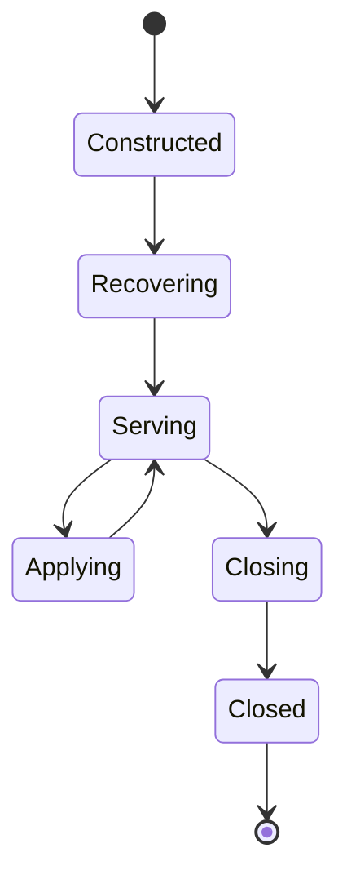

# Lesson 04: Core Server Lifecycle

## Goal

Understand the orchestration hub that turns Raft events into applied state and
coordinates readiness, snapshots, membership, and shutdown.

## Important files

- [etcdserver/server.go](../etcdserver/server.go)
- [etcdserver/raft.go](../etcdserver/raft.go)
- [proposal waiting in etcdserver/server.go](../etcdserver/server.go)
- [etcdserver/snapshot_merge.go](../etcdserver/snapshot_merge.go)
- [etcdserver/v3_server.go](../etcdserver/v3_server.go)

## How to read server.go

First identify the server object and collaborators, startup and shutdown, the
Raft event loop, proposal submission, committed-entry application, and
snapshot/membership hooks. Then follow one event through those areas.

## Proposal and commitment

An API method can create a proposal, but it becomes authoritative only when
Raft commits it. The lifecycle loop receives committed entries in order and
passes them to the applier. wait.go connects the original proposal with its
result or error.

## v3_server.go

This is a facade over the core lifecycle. It exposes KV, transactions, watches,
leases, auth, alarms, and downgrade behavior to the RPC layer. Read it as an
adapter and policy boundary, not as the storage engine.

## Shutdown

Listeners stop accepting work, background loops are signaled, Raft and storage
close safely, and waiters are released rather than left blocked. Follow context
cancellation and channel closure closely.

## Exercise

Find one successful proposal path and one rejected path. List where each can
fail: validation, authorization, Raft, apply, storage, or shutdown.

## Checkpoint

Which component knows that an operation is committed, and which knows how to
apply its meaning?

## File-by-file guide

### etcdserver/server.go

Begin with the EtcdServer fields to learn its collaborators, then read
construction, start, coordination loops, and close. Channels and notifiers
reveal how Raft, apply, linearizable reads, snapshots, and shutdown communicate.

### etcdserver/raft.go

This is the local adapter to the Raft node. Trace proposal input, Ready output,
WAL persistence, peer messages, committed entries, and snapshots. It translates
Raft's event model into server channels and state machines.

### proposal waiting in etcdserver/server.go

This matches an API caller with the result of its proposal. Follow registration,
lookup, completion, timeout, and cancellation. The invariant is that a response
belongs to the committed operation that created the waiter.

### etcdserver/snapshot_merge.go

This coordinates snapshot creation and restoration at the server boundary.
Follow how it obtains a consistent state point, interacts with storage, and
exposes snapshot information to Raft and peers.

### etcdserver/v3_server.go

This facade converts v3 operations into core-server calls. Classify each method
as local read, coordinated read, proposal, or maintenance operation, then
follow its error and protobuf response conversion.

For the complete Raft explanation, continue with [Lesson 13](./13-raft-in-this-project.md).

## Useful tests

- [raft_test.go](../etcdserver/raft_test.go) tests the Raft adapter and
  committed-entry behavior.
- [server_test.go](../etcdserver/server_test.go) covers lifecycle coordination.
- [server_access_control_test.go](../etcdserver/server_access_control_test.go)
  covers lifecycle and authorization interaction.

## Lifecycle diagram

