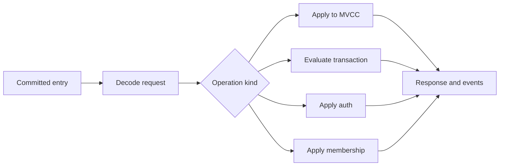

# Lesson 05: Committed Request Application

## Goal

Learn how a committed Raft entry becomes deterministic changes to server state.

## Important files

- [apply/interface.go](../etcdserver/apply/interface.go)
- [apply/apply.go](../etcdserver/apply/apply.go)
- [apply/backend.go](../etcdserver/apply/backend.go)
- [txn/txn.go](../etcdserver/txn/txn.go)
- [apply/capped.go](../etcdserver/apply/capped.go)
- [apply/auth.go](../etcdserver/apply/auth.go)

## The applier boundary

interface.go is an architectural map. Its dependencies include MVCC KV,
alarm store, auth store, lessor, cluster, Raft status, snapshot support, and
consistent-index support. These are the state machines a committed operation may
affect.

## Application sequence

~~~text
committed entry -> decode -> identify operation
                 -> apply deterministic side effects
                 -> persist/update indexes -> response/events
~~~

The applier processes operations in Raft order. It must not invent a second
ordering from goroutine scheduling or arrival time.

## Backend and transactions

apply/backend.go handles durable state beyond a simple KV mutation: membership,
auth, alarms, and related metadata. Transaction code groups comparisons and
operations so one committed request has one coherent result.

## Quotas

The capped applier guards the backend capacity boundary. Study it to see how
limits are enforced without duplicating quota policy in every RPC.

## Checkpoint

## File-by-file guide

### apply/interface.go

Start here because its interfaces define the apply boundary. ApplierOptions is
an architectural map: KV, alarm store, auth store, lessor, cluster, Raft status,
snapshot support, and consistent index each name a collaborator and invariant.

### apply/apply.go

This dispatches committed operations. Follow decoding, operation classification,
the difference between read-only and state-changing work, and response
creation. Look for the point where intention becomes an apply-time side effect.

### apply/backend.go

This handles durable state beyond a simple KV mutation, including membership,
auth, alarms, and metadata. Read it with schema and MVCC to understand the
transaction boundaries around one committed request.

### etcdserver/txn/txn.go

Transaction code evaluates comparisons, selects a branch, and applies the
selected operations as one ordered request. Trace comparison values, revision
selection, dispatch, and final response.

### apply/capped.go

This wrapper enforces backend-quota behavior at one boundary instead of
duplicating limits in every RPC. Follow rejected writes and alarm/error flow.

### apply/auth.go

This wraps applied operations with authorization checks for keys, transactions,
leases, users, and roles. Compare it with RPC auth: one protects the caller;
the other protects replicated effects.

Compare a simple Put with a transaction. Identify what is common in application
and what is special about comparisons and multiple operations.

## Useful tests

- [uber_applier_test.go](../etcdserver/apply/uber_applier_test.go) shows quota,
  corruption, and alarm propagation through applier wrappers.
- [auth_test.go](../etcdserver/apply/auth_test.go) covers auth during apply.
- [txn_test.go](../etcdserver/txn/txn_test.go) covers transaction comparison
  and operation selection.

## Apply diagram

