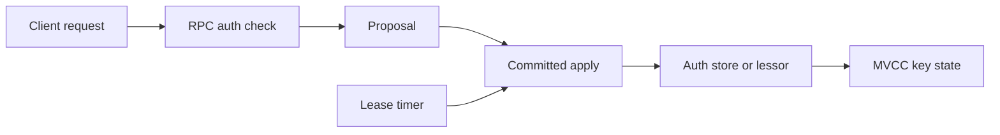

# Lesson 09: Authentication and Leases

## Goal

Understand authorization and time-based liveness as cross-cutting state machines.

## Authentication files

- [auth/store.go](../auth/store.go)
- [api/v3rpc/auth.go](../etcdserver/api/v3rpc/auth.go)
- [apply/auth.go](../etcdserver/apply/auth.go)

The auth store owns users, roles, permissions, password checks, revisions, and
token-provider integration. RPC code identifies and checks callers; apply
executes committed changes to auth state. Keep these responsibilities separate.

## Lease files

- [lease/lease.go](../lease/lease.go)
- [lease/lessor.go](../lease/lessor.go)
- [api/v3rpc/lease.go](../etcdserver/api/v3rpc/lease.go)

A lease represents time-bounded ownership. The lessor manages creation,
keep-alives, expiry, and attached keys. Expiry may be detected by a local timer,
but resulting replicated key changes must respect the ordered state model.

## Interaction with KV

Authentication determines who may read or propose. Leases determine how long
attached keys remain valid. Both appear in API validation, apply dependencies,
MVCC behavior, and tests.

## Exercise

For a lease-backed key, identify the API call, replicated operation, lessor
state, MVCC key, and event produced when the lease expires.

## Checkpoint

Which lease operations must be replicated, and which timer work can remain local?

## Useful tests

- [store_test.go](../auth/store_test.go) covers users, roles, permissions, and
  auth-store behavior.
- [range_perm_cache_test.go](../auth/range_perm_cache_test.go) explains cached
  permission lookup.
- [lessor_test.go](../lease/lessor_test.go) covers lease lifecycle and expiry.
- [lease_queue_test.go](../lease/lease_queue_test.go) explains expiration queue.
- [auth_test.go](../etcdserver/apply/auth_test.go) connects auth to application.

## Security and lease diagram

## File-by-file guide

### auth/store.go

This owns auth state. Read user and role storage, permission matching, password
verification, token handling, revision updates, and persistence. Separate
inspection methods from mutations that must be replicated.

### api/v3rpc/auth.go

This adapts authentication RPCs to the auth store. Follow request decoding,
auth-context checks, error mapping, and response conversion. It protects the
API boundary but does not replace apply-time checks.

### apply/auth.go

This applies committed auth and key operations with authorization checks. Compare
its dependencies with auth/store.go to see how replicated effects are protected.

### lease/lease.go

This models one lease: identity, TTL, expiration, and attached keys. Read its
methods as the local state contract used by lessor and apply code.

### lease/lessor.go

The lessor manages all leases, keep-alives, expiry detection, and key detachment.
Follow timer events into the operation that removes expired keys.

### api/v3rpc/lease.go

This converts lease RPCs into server operations and streaming keep-alives.
Trace creation, refresh, revoke, lookup, and error paths separately.
