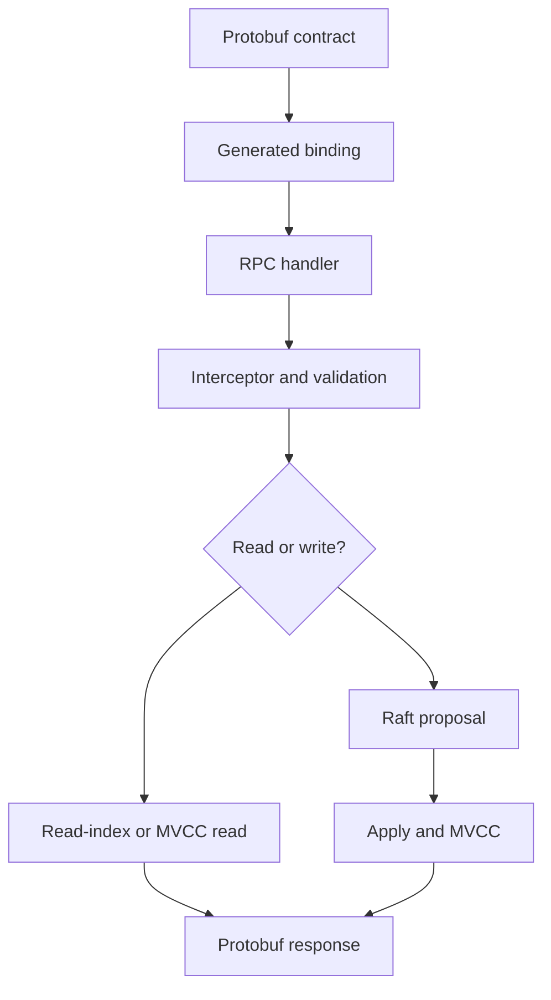

# Lesson 10: API and Protocol Contracts

## Goal

Read the server from public contracts inward.

## Important files

- [api/](../../api/)
- [api/v3rpc/](../etcdserver/api/v3rpc/)
- [api/v3rpc/interceptor.go](../etcdserver/api/v3rpc/interceptor.go)
- [api/v3rpc/key.go](../etcdserver/api/v3rpc/key.go)
- [api/v3rpc/watch.go](../etcdserver/api/v3rpc/watch.go)
- [api/v3rpc/lease.go](../etcdserver/api/v3rpc/lease.go)
- [api/v3rpc/maintenance.go](../etcdserver/api/v3rpc/maintenance.go)

## Contract-first sequence

~~~text
protobuf -> generated binding -> RPC implementation
         -> interceptor/validation/auth -> proposal or read-index
         -> apply or MVCC query -> protobuf response
~~~

Generated files show contract shape; handwritten RPC files show policy and
control flow. Protobuf is not the storage engine.

## Streaming watches

Watch RPCs remain active across events. Study context cancellation, backpressure,
event conversion, and cleanup. Stream lifecycle matters as much as its first
response.

## Exercise

Choose one RPC and document request type, validation, authorization, read/write
behavior, response type, and cancellation behavior.

## Checkpoint

Which behavior is guaranteed by the protocol contract, and which is an
implementation detail?

## Useful tests

- [key_test.go](../etcdserver/api/v3rpc/key_test.go) covers KV API behavior.
- [watch_test.go](../etcdserver/api/v3rpc/watch_test.go) covers streaming
  watch behavior and response compatibility.
- [validationfuzz_test.go](../etcdserver/api/v3rpc/validationfuzz_test.go)
  explores malformed request validation.
- [auth_test.go](../etcdserver/apply/auth_test.go) covers RPC/apply auth.

## RPC-to-state diagram

## File-by-file guide

### api/

This contains protobuf schemas and generated bindings shared with clients. Read
service and message definitions first to understand fields, streaming, and
response shapes. Generated code should normally be regenerated, not edited.

### api/v3rpc/

This is the handwritten server adapter layer. It registers services, converts
requests, applies policy, and calls the core server. It is the best feature
starting point because it exposes the public entry point.

### interceptor.go

Interceptors implement cross-cutting context setup, logging, tracing, metrics,
and authentication hooks. Read wrapper order because it changes which checks
happen first.

### kv.go

This implements KV RPCs and translates range, Put, Delete, and transaction
requests into server calls. Trace one read and one write to see the difference
between querying MVCC and proposing a mutation.

### watch.go

This implements the bidirectional watch stream, permission checks, filtering,
progress responses, cancellation, and cleanup. Client commands create/cancel;
MVCC events flow back to the client.

### lease.go and maintenance.go

These adapt lease and operational requests. Follow validation and error mapping,
then continue into v3_server.go to find the actual state owner.
