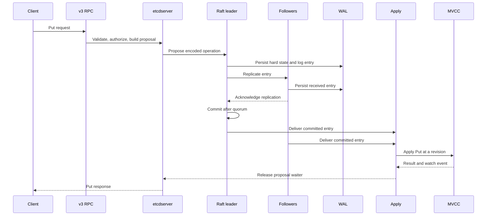
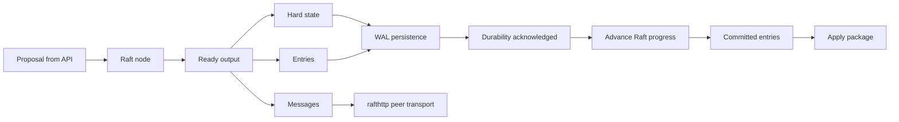
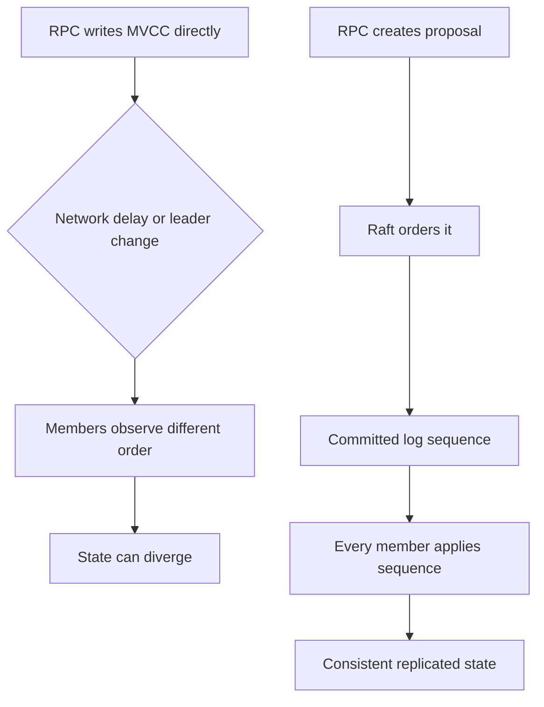
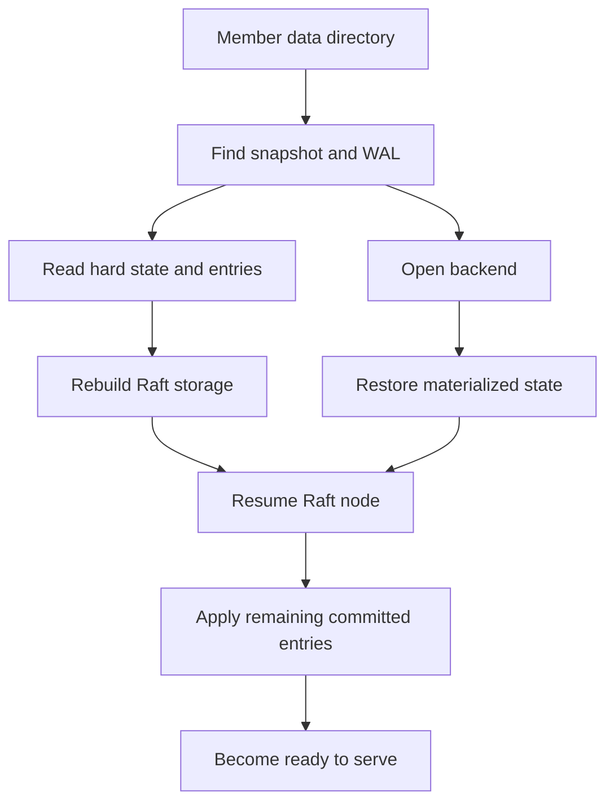

# Lesson 13: How Raft Is Used in This Project

## Goal

Understand exactly where Raft appears in the etcd server, what work it owns,
what work it does not own, and how an operation travels from one client to the
state machines on every member.

## What Raft provides

Raft is the replicated log and consensus layer. It gives the cluster one
authoritative order for operations even though clients may connect to different
members and messages may arrive at different times.

Raft does not implement the key-value database, authentication, leases, or the
gRPC API. It orders opaque entries. The etcd server decodes those entries and
applies their meaning to its local state machines.

## Where Raft is used

Start with these locations:

- [etcdserver/raft.go](../etcdserver/raft.go): connects the etcd server to the
  Raft node and processes Raft output.
- [etcdserver/server.go](../etcdserver/server.go): owns proposal handling,
  committed-entry application, readiness, snapshots, and lifecycle.
- [etcdserver/bootstrap.go](../etcdserver/bootstrap.go): reconstructs Raft
  storage and server state during startup and recovery.
- [storage/storage.go](../storage/storage.go): connects WAL and snapshot state
  to the Raft storage abstraction.
- [storage/wal/](../storage/wal/): persists Raft hard state and log entries.
- [etcdserver/api/rafthttp/](../etcdserver/api/rafthttp/): transports Raft
  messages and snapshots between members.
- [etcdserver/membership/](../etcdserver/membership/): tracks the cluster
  members whose configuration is used by Raft.
- [etcdserver/snapshot.go](../etcdserver/snapshot.go): coordinates compact
  state transfer and local snapshot handling.

Use [etcdserver/raft_test.go](../etcdserver/raft_test.go) and the related
server tests to see the expected boundaries rather than inferring behavior
from names alone.

## The central separation: order versus meaning

This distinction explains most of the server architecture:

| Responsibility | Owner |
| --- | --- |
| Accept a client request | v3 RPC and server facade |
| Check permissions and request shape | RPC/interceptor/auth layers |
| Agree on operation order | Raft |
| Persist Raft progress | WAL/backend integration |
| Interpret a committed operation | apply package |
| Store versioned keys | MVCC |
| Notify watchers | MVCC watch layer |
| Exchange log messages | rafthttp peer transport |

Raft entries are the bridge. The entry carries an encoded operation; Raft
orders it; the apply layer gives it meaning.

## Diagram 1: a client write



The leader does not send a successful response merely because it received the
request. The operation must be committed and applied. A follower can also
apply the same committed entry, usually without being the member that received
the original client request.

## Step 1: a request becomes a proposal

The client-facing API validates the request and checks authorization. The
server facade then prepares an operation for the Raft path. At this point the
operation is not yet part of the cluster history.

Questions to answer while reading:

1. What data is encoded into the proposal?
2. How is the originating request associated with its eventual response?
3. What happens if the local member is not the leader?
4. What happens if the proposal times out before commitment?

Read the KV RPC, v3 server facade, proposal/wait code, and then raft.go.

## Step 2: Raft replicates the entry

The Raft node maintains the replicated log and leader/follower state. The
leader sends entries to peers through the peer transport. Followers persist
entries and acknowledge them. The leader can advance commitment only when the
required quorum has accepted the entry according to Raft rules.

The entry itself is deliberately less intelligent than the server. Raft does
not know that an entry means Put, Delete, transaction, auth update, or member
change. It only manages ordered replication.

## Diagram 2: the Raft event loop boundary



Study raft.go by identifying how the server consumes each category of Raft
output: hard state, entries, messages, snapshots, and committed entries. A
common mistake is to look only for the word commit and miss the persistence
step that makes recovery safe.

## Step 3: WAL persistence

The WAL records Raft hard state and entries before the server treats the
corresponding progress as durable. This is why the WAL is part of the Raft
integration rather than an unrelated database log.

Read [storage/wal/wal.go](../storage/wal/wal.go) and ask:

- How are records opened after restart?
- When are segments rotated?
- Where is syncing performed?
- How are corruption and incomplete records handled?
- How do snapshot boundaries affect which entries remain useful?

The backend contains materialized logical state; the WAL contains consensus
history. They are related but not interchangeable.

## Step 4: commitment and application

Once Raft determines that an entry is committed, each member receives it in
commit order. The etcd server sends the operation to the apply layer. Apply
decodes the operation and calls MVCC, membership, auth, lease, alarm, or other
state components as appropriate.

This is the most important boundary in the project:

```text
Raft: “this entry is authoritative and belongs at position N”
Apply: “this is what the entry means and how local state changes”
```

Because every member applies the same committed sequence, deterministic apply
logic produces equivalent state on healthy members.

## Diagram 3: why direct RPC writes are unsafe



The apply layer is not merely an implementation preference. It is what makes
the state-machine model work.

## Leaders, followers, and learners

The leader coordinates log replication and commitment. Followers replicate the
log and apply committed entries. Learners participate in replication without
being voting members until they are promoted through the membership process.

When reading code, do not assume “local member” means “leader”. A follower can
serve some reads, receive committed entries, host a complete MVCC state, and
communicate with peers while being unable to commit a proposal itself.

## Peer transport: rafthttp

The rafthttp package is the network adapter between the local Raft node and
remote members. It carries Raft messages, log-related communication, and
snapshots. It does not replace Raft; it transports the inputs and outputs that
allow separate Raft nodes to cooperate.

Trace a peer message in this order:

1. Raft produces a message.
2. The server hands it to peer transport.
3. rafthttp selects the target member and sends it.
4. The remote member feeds it into its Raft node.
5. The remote node produces new Ready output or progress.

## Membership and Raft

Member add, remove, promote, and update operations change the set of peers
participating in consensus. That is why membership changes are coordinated by
the server and represented in the replicated operation flow instead of being
treated as local configuration edits.

Read membership together with raft.go and rafthttp. Ask which state is the
current cluster membership, which state is persisted, and which state is
actively used to send messages.

## Diagram 4: recovery



A restarted member must recover both consensus progress and logical state. A
snapshot reduces replay work; the WAL supplies newer entries and hard state;
the backend supplies the already-materialized database.

## Snapshots and log compaction

Raft logs grow. The server periodically creates snapshots and can discard log
history that is no longer needed for recovery. A snapshot must be tied to a
known point in the replicated history. It is not simply an arbitrary copy of a
backend file.

Read etcdserver snapshot code, storage snapshot code, WAL reopening, and
bootstrap together. The useful question is: after restoring this snapshot,
from which index must the member continue applying entries?

## Linearizable and serializable reads

Not every read needs a new replicated log entry. A serializable read can use a
local member's state and may be slightly behind the leader. A linearizable read
needs a freshness/leadership guarantee, commonly through the Raft/read-index
coordination path, before consulting MVCC.

When studying a read RPC, identify whether it performs:

- a local MVCC read;
- a read-index or equivalent coordination step;
- a proposal that enters the replicated log.

This distinction explains why “all requests use Raft” is an inaccurate mental
model. All cluster-wide mutations need ordered application; reads have several
consistency paths.

## Debugging checklist

When a Raft-related behavior is confusing, inspect the layers in this order:

1. Is the client connected to the intended member and URL?
2. Is the member leader, follower, or learner?
3. Did the request become a proposal?
4. Was the entry written to the WAL?
5. Was it replicated to a quorum?
6. Was it marked committed?
7. Was it delivered to apply?
8. Did MVCC/backend application succeed?
9. Was the waiter or stream response released?

This sequence prevents confusing transport failure, consensus delay, storage
failure, and application failure.

## Exercises

### Exercise A: locate the boundaries

Open raft.go and mark the code that handles proposal input, peer messages,
Ready output, WAL persistence, committed entries, and shutdown.

### Exercise B: follow a failed write

Choose a test for a proposal timeout, lost leadership, or apply error. Explain
which Raft stage completed and which stage did not.

### Exercise C: compare two members

For a three-member cluster, draw leader, follower, and learner roles. Mark which
members receive the entry, which acknowledge it, which can commit it, and which
apply it.

### Exercise D: explain recovery

Use bootstrap and durability code to explain how a member recovers after
crashing immediately after WAL persistence but before application.

## Final checkpoint

Answer these without looking at the dashboard:

1. Where is the operation ordered?
2. Where is it persisted as Raft history?
3. Where is it interpreted as a Put or transaction?
4. Where is the resulting revision stored?
5. How do peers receive the operation?
6. What does a snapshot change about recovery?

If you can answer these six questions with file and package names, you have the
correct Raft mental model for this project.

